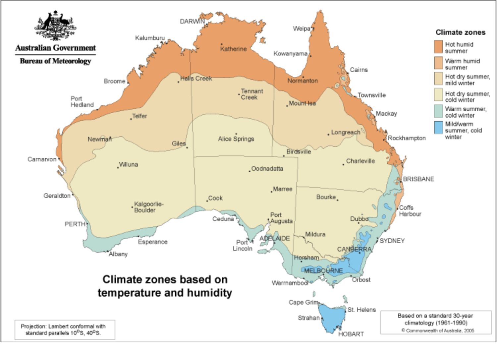
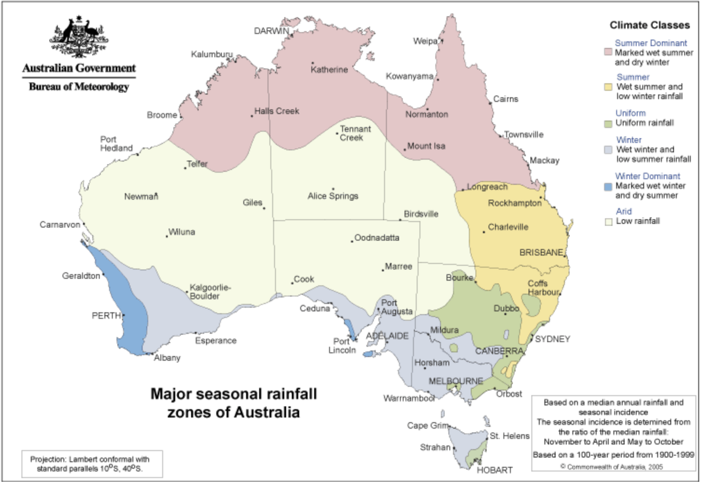

```{r setup, include=FALSE}

knitr::opts_chunk$set(echo = FALSE,
                      warning = FALSE,
                      message = FALSE,
                      out.width="85%",
                      fig.align="center")

# Installation----
# Listing the required packages
required_packages <- c("tidyverse","ggrepel","gghighlight",
                       "gridExtra","viridisLite","viridis",
                       "scales","lubridate","stats","broom",
                       "knitr","DescTools","corrplot","naniar",
                       "tsbox","dygraphs","ozmaps","sf",
                       "caret","randomForest","xgboost")

# Installing the packages and loading the libraries
# Will simply load the library if the package is already installed
for (p in required_packages) {
  if(!require(p, character.only = TRUE)) {install.packages(p, dep = TRUE,
                                repos = "http://cran.us.r-project.org")}
}

```

# Executive Summary #

## Goal of the study and available data##
The goal of this study is to predict **next day rain in 49 locations** in Australia. This challenge was posted by Joe Young on Kaggle at **[Rain in Australia](https://www.kaggle.com/jsphyg/weather-dataset-rattle-package)**.

The data set available for the challenge contains about 10 years (of which 8 years are complete, 2009-2016) of daily weather observations from 49 Australian weather stations. RainTomorrow is the target variable to predict. It means: did it rain the next day, Yes or No? 
The column is Yes if the rain for that day was 1mm or more.

The data set contains daily observations of a number of categorical (like wind direction) and numeric (like temperature, pressure, evaporation) variables for each location. Certain variables are observed twice daily, at 9am and 3pm. The data set also contains the RainTomorrow column for model calibration.

```{r data_load, include=FALSE}
# Loading the data----

# We load two files:
# - the original data file weatherAUS
# - a small file locationsAUS with data about Australian locations, 
#  containing coordinates, state and population, which we will use 
#  for maps

# If the csv files are available in the working directory:
if(file.exists("weatherAUS.csv")) weatherAUS <- read.csv("weatherAUS.csv")
if(file.exists("locationsAUS.csv")) locationsAUS <- read.csv("locationsAUS.csv")

# Otherwise download the files from GitHub:
url_file <- "https://raw.githubusercontent.com/vpluchet/capstone2/main/weatherAUS.csv"
url_loc <- "https://raw.githubusercontent.com/vpluchet/capstone2/main/locationsAUS.csv"

if(!exists("weatherAUS")) weatherAUS <- read_csv(url(url_file), col_types = cols(.default = "d",
                                                       Date = "c",
                                                       Location = "c",
                                                       WindGustDir = "c",
                                                       WindDir9am = "c",
                                                       WindDir3pm = "c",
                                                       RainToday = "c",
                                                       RainTomorrow = "c"))

if(!exists("locationsAUS")) locationsAUS <- read_csv(url(url_loc), col_types = cols(
  Location = "c",
  lat = "d",
  lng = "d",
  state = "c",
  population = "d"))


# Preparing information for future use----

# Defining some default colors for scatterplots
c_red <- "#F8766D"
c_blue <- "#00B4F0"

n_dat <- nrow(weatherAUS) # for use in report

# Extracting the locations
locations <- weatherAUS$Location %>%
  unique()
locations <- locations[order(locations)] %>% data.frame()
colnames(locations) = "Location"

# Populating locations with coordinates, state and population
# We will use this data for maps
locations <- locations %>% left_join(locationsAUS, by = "Location")

# Checking that there are no NAs in locations
sum(is.na(locations))

# Extracting states co-ordinates for maps
oz_states <- ozmaps::ozmap_states

g_loc_size <- 6 # used to control text size for axis with location


# Creating a function to map Australia with points and a color scale
# We create this function because it will be used a few times when color
# scales are required.
# The inputs to the function are:
    # map_data: the points data, with longitude (lng) and latitude (lat)
    # map_color: the name of the variable in map_data which will be used
    #     to color the points; must be defined with the "sym" function
    # map_color_begin and map_color_end: integers between 0 and 1 to
    #     define the beginning and the end of the color gradient. This is
    #     use to have comparable color scales between the various maps
    # map_title, map_subtitle, map_caption: labs parameters; caption
    #     will typically be computed to reflect the plotted data range
f_map <- function(map_data, map_color, map_color_begin, map_color_end, 
                  map_title, map_subtitle, map_caption){
  ggplot(oz_states) + 
    geom_sf() + 
    coord_sf() +
    geom_point(data = map_data, aes(lng, lat, color = !!map_color), size = 4) +
    theme(panel.background = element_rect(fill = "lightblue"),
          panel.grid.minor.y = element_blank(),
          panel.grid.major = element_blank()) + 
    scale_color_viridis(discrete = FALSE, direction = -1, 
                        begin = map_color_begin, end = map_color_end,
                        option = "turbo") +
    labs(title = map_title,
         subtitle = map_subtitle,
         caption = map_caption)
}

```


The data set is a csv file called "weatherAUS.csv". It contains overall **`r format(n_dat, big.mark = ",")`** rows and **`r ncol(weatherAUS)`** columns.

For the purpose of this report, we also provide a small file containing information about the locations, namely longitude and latitude, which we use for map plots. The file is available on **[github](https://github.com/vpluchet/capstone2/blob/e2293454b49506ebb36a4137ee4a544b1b1ee11a/locationsAUS.csv)**.

The 49 locations are shown on the below map:
```{r map_loc}
# Initial Data exploration----
# The goal of this part is to determine whether some of the data
# should be either discarded because of insufficient relevance or
# errors


# Visualizing the locations on the map of Australia
# (here we do not use the f_map function, no color scale required)
map_loc <- ggplot(oz_states) + 
  geom_sf() + 
  coord_sf() +
  geom_point(data = locations, aes(lng, lat), size = 1, color = c_red) +
  geom_text_repel(data = locations, aes(lng, lat, label = Location),
            size = 3,
            color = "darkblue",
            max.overlaps = 30) +
  theme(panel.background = element_rect(fill = "lightblue"),
        panel.grid.minor.y = element_blank(),
        panel.grid.major = element_blank(),
        plot.title = element_text(hjust = 0.5)) +
  labs(title = "Map of Australia with the 49 weather locations")

# Printing the map takes a couple of seconds
# Warning: printing the map sometimes generates a message that the 
# polygon edge was not found. If this happens, re-run the above command
# defining the map (map_loc <- ...) and re-print
print(map_loc)
```

## Specific challenges ##
There are at least three interesting challenges in this study.

* The first challenge is the diversity of the Australian climate. Australia is a huge country with at least 6 main climate zones, as evidenced by the below map posted by the **[Bureau of Meteorology of Australia](http://www.bom.gov.au/jsp/ncc/climate_averages/climate-classifications/index.jsp)**. Seasonal rainfall behaves very differently according to location, as shown on the **[Seasonal Rainfall map](http://www.bom.gov.au/jsp/ncc/climate_averages/climate-classifications/index.jsp?maptype=seasgrpb#maps)**. For instance, climate is very different in Darwin and Sydney. Darwin has significant rainfall in summer and dry winters, whereas Sydney has a relatively uniform rainfall (note: Southern Hemisphere summer is December-February). Any prediction model must therefore take such differences into account.

```{r, fig.cap="**Australian climates (copyright: Bureau of Meteorology, Australian Government)**", fig.align="center"}

```

```{r, fig.cap="**Australian Seasonal Rainfall (copyright: Bureau of Meteorology, Australian Government)**", fig.align="center"}

```


* The second challenge is that rain remains a highly random phenomenon versus the variables measured in the data set. No variable in the set, and no combination of variables, can predict rain with a high degree of certainty. There remains a high random component. Average patterns can be detected but cannot be used in a deterministic way. For instance, we anticipate, on average, that if pressure is low and drops further during the day, this announces a higher chance of next day rain. But, as we will see in the data analysis section, there are many such situations which are not followed by rain, and there are opposite situations followed by rain.

* The third challenge is inherent to the data set itself. Several variables have significant NA levels (Not Available). For instance, Sunshine, a variable which measures the number of hours of bright sunshine in the day, has a non-negligible negative correlation with next day rain: if a day has low Sunshine, the chances of rain are higher. It is therefore a very interesting variable in a prediction model. However in the data set, `r percent(mean(is.na(weatherAUS$Sunshine)))` of the Sunshine data is NA.

"Predict Rain in Australia" is, as a consequence, a very interesting data science challenge.

## Objective ##

* weatherAUS is a small data set. It cannot compete with the data sets used by weather specialists worldwide, which use millions of data processed on very powerful servers. The beauty of weatherAUS is that it can be run on a simple laptop and offers a glimpse into the fascinating world of weather forecasting. Weather forecasts nowadays give us very accurate information not only about whether there will be rain or not, but also at what time, how much rainfall should be expected and with what likelihood. We cannot achieve the same performance with a data set which contains, at best, two daily observations.
* Another factor to consider is the high prevalence of "No Rain" in the data. On average, as per the data set, the proportion of days with rain (rainfall > 1mm)  is only `r percent(mean(weatherAUS$Rainfall > 1, na.rm = TRUE))`. This means that a model which would predict "No Rain" would have an accuracy around 78%, which could seem high. This would be a poor model however: it would have a high Specificity (the capacity to correctly predict No Rain Tomorrow) of 100% but a Sensitivity (the capacity to correctly predict Rain Tomorrow) of 0%, since it would always predict No Rain. Therefore its Balanced Accuracy, the average between Sensitivity and Specificity, would be 50%, which is quite low.
* Our objective is therefore to obtain reasonably better Accuracy and Sensitivity levels, without hurting Specificity too much and achieving a relatively good Balanced Accuracy. We consider the Balanced Accuracy rather than an F1 score because we want to give equal weights to Rain predictions and No Rain predictions. We will also assess the predictive values, ie the accuracy of predicting Rain or No Rain.
* We will consider model results per location as well, not just national averages. This is important in order to reflect the diversity of the Australian climate zones and to provide accurate local forecasts.

## Approach and Model Used ##
* The prediction algorithm for this study was developed using the R programming language.
* For the purpose of model selection and validation, the data set was split between a training data set (called "weather"), containing around 80% of the data, and a validation set (called "validation"), containing around 20% of the data. These proportions were chosen in order to have enough data for model calibration, given the number of locations and variables involved, while still retaining a validation set of significant size. The validation set was kept completely independent from the training set, and was not used at any stage of the model preparation, training or selection. It was only used with the final selected model, in order to measure the performance of the model on an entirely new data set.
* For model training and cross-validation, the "weather" training set was itself partitioned into weather_train (80%) and weather_test sets (20%).
* The NA data was populated using the median for each Location-Month combination. Indeed, given the diversity of the locations, we did not want to populate NAs with global averages, except where necessary due to lack of data. We also did not want to use yearly averages, as there are clear seasonality trends in the data (rainfall in Summer is different than in Winter). For categorical data, the mode was used (the most frequent category value) on a similar basis. We did **not** use any of the "validation" data to populate the NAs, even in the validation set. We performed a small analysis during training to see if the NA replacement method used was distorting the results: no significant distortion was observed.
* New variables were added, replacing some of the provided data. As an example, the data set contains Temp9am and Temp3pm, the temperature measured at 9am and 3pm. These two indicators are highly correlated. It is therefore more interesting to compute, as a new variable, the difference between Temp9am and Temp3pm: thus we can keep Temp3pm and the temperature variation, which provides a trend (is temperature increasing or decreasing). This did improve a bit the performance of the algorithm by removing excessive collinearity.
* Several algorithms were tested and compared in the study, including:
  * simple deterministic models
  * GLM using various predictors or combinations of predictors
  * Random Forest
  * XG Boost, an implementation of gradient boosted decision trees designed for speed and performance
  * QDA, quadratic discriminant analysis
  * KNN, k-Nearest Neighbors
  * An ensemble of the 5 above methods (GLM, RF, XG, QDA, KNN)
  * An ensemble of 3 methods (XG, GLM, QDA)
* Where appropriate, comparisons were made between "global" models (one model for all locations) and "local" models (one separate model for each location). The local models usually perform better than the global models, as they are better capable of handling the specific patterns of each location.
* We assessed 4 primary indicators for each model:
  * Accuracy: accuracy of overall Rain & No-Rain predictions
  * Sensitivity: accuracy of predicting actual rain events
  * Specificity: accuracy of predicting actual no-rain events
  * Balanced Accuracy: average between Sensitivity and Specificity
* For GLM, we used p_values, VIF (variance inflation factor) and ANOVA to analyze the significance of the variables used and the robustness of the model (more details are provided in the model development section).
* Interestingly, advanced algorithms (ie all the above models excluding the simplest ones) all performed within a range of similar results during the training phase: accuracy differences on the training test set were below 4 points, which is not negligible but not huge either and a proof of consistency. Overall results, as well as results by location, still identified very clearly that the best performing models were GLM and XG Boost (before introducing the ensembles). Then the ensembles were created to maximize results by combining the results from the various models.
* **The final selected model is the ensemble of three methods: XG Boost, GLM and QDA**, with predictions based on the majority vote between the three algorithms. This model had the best performance on Accuracy, Sensitivity and Balanced Accuracy, globally and at location level. GLM and QDA are applied locally (one model per location) following a Principal Component Analysis. XG Boost is applied globally, using longitude and latitude to replace the locations.
* Whilst not strictly necessary, the Principal Component Analysis (PCA) allows to deliver more robust models, with de-correlated and significant predictors. PCA does not improve the overall accuracy (and should not be expected to do so as it is essentially a re-combination of the original predictors).


## Results ##
* The selected model "Ensemble 3" was tested on the independent validation set
* The detailed results are presented in the Results section, with the key points highlighted here.
* The overall Accuracy is 86.2%, ranging 77%-95% between the various locations. 3 locations out of 49 have an accuracy between 77-80%, 18 are between 80-85%, 18 between 85-90% and 10 above 90%. This is a very good result, showing that the model addressed the diversity of the various locations.
* The Sensitivity is 58.2% (accuracy of predicting actual rain), ranging 30-78% by location (however only 4 locations are below 50%). This is the weak point of the modelization and is not specific to the validation set. All models during the training phase had low sensitivity, QDA having the best result at 60% on the test set but poorer accuracy than other models. Our interpretation is that there remains significant randomness in the rain outcome versus the data measured in the data set: scatterplots in the data analysis section illustrate this point.
* The Specificity is 94.4% (accuracy of predicting actual no-rain), ranging 88%-99% by location. 46 locations are above 90%. This is a strong result.
* The "No Rain" predicting value is 88.6%, meaning that when the model predicts No Rain, the prediction is true in 88.6% of the cases.
* The "Rain" predicting value is 75.1%, meaning that when the model predicts Rain, the prediction is true in 75.1% of the cases.
* The Balanced Accuracy is 76.3%.
* These results are in line with our stated objectives, although Sensitivity remains on the low side. The algorithm performs best in the central locations, where the weather is more stable, less well in the coastal locations of Southern Australia, where the oceanic influence is strong and probably induces significant weather variability. The Model Development and Results sections provide additional information on this.
* In the Conclusion section, we try to highlight additional studies which could further improve the results.

\newpage

# Data Analysis #

This section contains three main parts:

1. A preliminary review of the data set, to understand where data is missing, if there are specific measurement errors that would need to be taken care of, and if certain elements should be removed from the data set ahead of analysis and modeling. At the end of this part, certain non-useful rows are removed from weatherAUS, and the training set "weather" as well as the "validation" set are created by partitioning weatherAUS. From this point onward, the validation set is set aside and not used, any further analysis is made on the training set only.
2. Further data exploration, to understand better the behavior and influence of the various predictors, namely: the location effect, the time effect, the correlation between the predictors and the capacity of each predictor to provide information about whether there will be rain tomorrow or not.
3. The last part consists in preparing the training set for the modelization part, computing the NA replacement values, computing some additional variables to be used in the analysis, and splitting the training set into weather_train and weather_test for model training and cross-validation purpose.

## Preliminary data review ##

```{r prelim, include = FALSE}
# Computing percentage of NA per predictor
pna <- weatherAUS %>% is.na() %>% 
  colMeans() %>%
  data.frame(Perc_NA = .) %>%
  arrange(desc(Perc_NA)) %>%
  mutate(Item = rownames(.))

# Plotting the percentages
# The graph shows Sunshine, Evaporation, Cloud3pm, Cloud9am having 
# high NA percentages
gpna <- pna %>%
  mutate(Item = reorder(Item, Perc_NA)) %>%
  ggplot(aes(Item, Perc_NA, label = scales::percent(Perc_NA, 0.1))) +
  geom_bar(stat = "identity", fill = "steelblue") +
  scale_y_continuous(labels = scales::percent) +
  geom_text(nudge_y = 0.02, size = 3) +
  coord_flip() +
  ylab("NA Percentage") +
  ggtitle("Percentage of NA data per Item")


# Sunshine has 48% NA values
perc_NA_Sunshine <- percent(mean(is.na(weatherAUS$Sunshine)))


# Computing percentage of NA per Location
# Using nianar package for easier graph
# The plot does not evidence any location with a significantly higher
# Proportion of missing data

g_pnal <- gg_miss_fct(x = weatherAUS, fct = Location) +
  ggtitle("Missing data percentage per Location") +
  theme(axis.text.y = element_text(size = g_loc_size)) +
  coord_flip()


# Focusing on Sunshine and Cloud3pm and looking at the percentage
# of NA per location

g_sc <- weatherAUS %>% 
  select(Location, Sunshine, Cloud3pm) %>%
  group_by(Location) %>%
  summarise(perc_NA_Sunshine = mean(is.na(Sunshine)),
            perc_NA_Cloud3pm = mean(is.na(Cloud3pm))) %>%
  mutate(Location = reorder(Location, perc_NA_Sunshine)) %>%
  ggplot() +
  geom_point(aes(Location, perc_NA_Sunshine, colour = "Sunshine")) +
  geom_point(aes(Location, perc_NA_Cloud3pm, colour = "Cloud3pm"),
             position = position_nudge(y = 0.004), alpha = 0.8) +
  scale_colour_manual(name="Color",
                      values=c(Sunshine="steelblue", Cloud3pm="orangered3")) +
  scale_y_continuous(labels = scales::percent) +
  theme(axis.text.y = element_text(size = g_loc_size)) +
  coord_flip() +
  ylab("NA Percentage") +
  labs(title = "Percentage of Sunshine and Cloud3pm NA data",
       subtitle = "Cloud points slighlty nudged to the right")


# Counting number of data points by year
# The graph shows that years 2007-2008 and 2017 are incomplete
# We will therefore remove these years in data pre-processing
g_time_n <- weatherAUS %>%
  mutate(Year = year(parse_date(Date, format = "%Y-%m-%d"))) %>%
  group_by(Year) %>%
  summarise(count = n()) %>%
  ggplot(aes(Year, count)) +
  geom_point(color = "steelblue") +
  scale_x_continuous(breaks = seq(2007,2019,1)) +
  ggtitle("Number of data points per year")

# Exploring NAs per descriptor over time
# Using the naniar package for easier graph
# The plot shows that data collection has been relatively consistent over time
g_time_NA <- weatherAUS %>%
  mutate(Year = year(parse_date(Date, format = "%Y-%m-%d"))) %>%
  gg_miss_fct(fct = Year) +
  labs(title = "NA percentage per Variable per Year")


# Counting the number of observations per Location
# The graph shows three locations that have a much lower
# number of records. This requires further exploration.

g_loc_count <- weatherAUS %>% group_by(Location) %>%
  summarise(ncount = n()) %>%
  mutate(Location = reorder(Location, ncount)) %>%
  ggplot(aes(Location, ncount)) +
  geom_point(color = "steelblue") +
  ggtitle("Number of observations per Location in data set") +
  ylab("Number of observations") +
  theme(axis.text.y = element_text(size = g_loc_size)) +
  coord_flip()


# Re-plotting the number of observations for the three locations with few records
# The graph shows that records started in 2013 for these locations
# This is not an issue in itself and therefore the data can be kept
# 2017 is incomplete but this year will be removed
i_loc <- c("Uluru", "Nhil", "Katherine")
g_time_3loc <- weatherAUS %>%
  filter(Location %in% i_loc) %>%
  mutate(Year = year(parse_date(Date, format = "%Y-%m-%d"))) %>%
  group_by(Year, Location) %>%
  summarise(count = n()) %>%
  ggplot(aes(Year, count, color = Location)) +
  geom_point() +
  scale_x_continuous(breaks = seq(2007,2019,1)) +
  facet_wrap(Location ~ .) +
  
  labs(title = "Number of data points per year for selected locations")


# Box-Plotting the numeric items to detect outliers / unusual data points
# The graph shows some significant dispersion for some predictors.
# There are outliers, however no obvious erroneous values.
# Therefore no specific value restatements appear necessary
gnum <- weatherAUS[sapply(weatherAUS, is.numeric)] %>%
  pivot_longer(cols = 1:ncol(.), 
               names_to = "Predictor", values_to = "Value") %>%
  ggplot(aes(Predictor, Value)) +
  geom_boxplot(na.rm = TRUE, color = "steelblue") +
  facet_wrap(Predictor ~ ., scales = "free")
# Showing the plot (takes a few seconds)

# A few predictors show a heavy weight of zero values
# Rainfall is greater than 0 in 36% of the cases only, 
# and Rainfall is greater than 1 in 22% of the cases only,
# indicating that rainfall is generally rare
# We also check that RainToday is identical to Rainfall >1
perc0_Rainfall <- percent(mean(weatherAUS$Rainfall > 0, na.rm = TRUE))
perc1_Rainfall <- percent(mean(weatherAUS$Rainfall > 1, na.rm = TRUE))


```


### NA Percentages per predictor ###
We plot the percentage of NA data for each predictor. The plot shows Sunshine, Evaporation, Cloud3pm, Cloud9am having high NA percentages.
There are no NAs for either Date or Location. Other indicators show relatively low percentages of missing data.

```{r gpna}
print(gpna)
```


### NA Percentages per Location and predictor ###
We use the nianar package which provides an efficient graph. Whilst certain variables are missing for specific locations, the plot does not evidence any location with a significantly higher proportion of missing data. Therefore all locations can be used in the analysis. However, we will look at Sunshine and Cloud3pm in a more detailed way to see where they are missing (see next part).

```{r g_pnal}
print(g_pnal)
```


### Focusing on Sunshine and Cloud3pm ###

The graph shows that around 7 locations only have full Sunshine and Cloud3pm data (0% NA). Other locations like Wollongong have partial Cloud3pm data but no Sunshine. Certain locations like Walpole have no data on Sunshine or Cloud3pm. Several locations have partial data on both predictors. So we cannot have a simple split of locations between those which have the data and those which don't. We will need to find a way to handle the NA data.
```{r g_sc}
print(g_sc)
```


### Number of data points by year ###
The plot shows that years 2007-2008 and 2017 are incomplete. We will therefore remove these years in data pre-processing
```{r g_time_n}
print(g_time_n)
```


### Exploring NAs per descriptor over time ###
We use the naniar package for easier graphical representation. The plot shows that data collection has been relatively consistent over time
```{r g_time_NA}
print(g_time_NA)
```


### Number of observations per Location ###
The graph shows three locations that have a much lower number of records. This requires further exploration.
```{r g_loc_count}
print(g_loc_count)
```

### Zooming into the three locations with few records ### 
The graph shows that records started in 2013 for these locations. This is not an issue in itself and therefore the data can be kept. 2017 is incomplete but this year will be removed
```{r g_time_3loc}
print(g_time_3loc)
```


### Box-Plot of numeric items to detect outliers / unusual data points ###
The plot shows some significant dispersion for some predictors. A few predictors show a heavy weight of zero values. There are outliers, however no obvious erroneous values. Therefore no specific value restatements appear necessary. 
```{r gnum}
gnum
```


**A note on Rainfall and RainToday:**

Rainfall is greater than 0 in `r perc0_Rainfall` of the cases only.
Rainfall is greater than 1 in `r perc1_Rainfall` of the cases only, indicating that rainfall is generally rare.

We also check that RainToday is identical to Rainfall >1: `r identical(weatherAUS$Rainfall >1, ifelse(weatherAUS$RainToday == "No", FALSE, TRUE))`.

There is no need for fully correlated predictors, therefore we will remove either Rainfall or RainToday in the study.


### Preliminary review conclusion ###

Based on the above analysis, we will only apply two pre-processing steps before creating the Training and Validation sets:

* We retain only the complete years 2009-2016 (8 years)
* We remove rows with NA in RainTomorrow: as this will be our benchmark to measure the accuracy of the predictions, we cannot keep rows where this indicator is missing

We also convert the categorical variables to factors so that they can be used by the algorithms.


```{r base, include = FALSE}

# Building data base----
# Plus train, test and validation sets


# Building a data base by removing NAs in RainTomorrow
# Retaining only 2009-2016 (complete years)
# Converting character columns to factors
weather_base <- weatherAUS %>% 
  filter(!is.na(RainTomorrow)) %>%
  mutate(Date = parse_date(Date, format = "%Y-%m-%d"),
         Year = year(Date),
         WindGustDir = factor(WindGustDir),
         WindDir9am = factor(WindDir9am),
         WindDir3pm = factor(WindDir3pm),
         Location = factor(Location),
         RainToday = factor(RainToday),
         RainTomorrow = factor(RainTomorrow)) %>%
  filter(Year %in% 2009:2016) %>% 
  select(-Year)

# Computing percentage of data retained (90%)
n_wea <- nrow(weather_base) 
prop_n <- percent(n_wea / n_dat)

# Creating a table with the order of the columns (will be used after certain
# pivot_wider operations)
col_order <- data.frame(Name = colnames(weather_base), Rank = 1:ncol(weather_base))


# Creating a Validation set which will be used only at the very end
set.seed(1, sample.kind = "Rounding")
index_part <- createDataPartition(weather_base$RainTomorrow, times = 1,
                                  p = 0.2, list = FALSE)
validation <- weather_base[index_part,] # Ultimate validation set
weather <-  weather_base[-index_part,] # Working set for model definition

# Making sure Location-Month combinations in validation set 
# are present in base set, as this will be used to populate NAs
validation <- semi_join(x = validation %>%
                                  mutate(key = paste(Location, month(Date), sep = "|")),
                                y = weather %>%
                                  mutate(key = paste(Location, month(Date), sep = "|")),
                                by = "key") %>% select(-key)

# in practice with seed 1 there are no removed rows however procedure kept 
# in case a different seed produces different results
removed <- anti_join(x = validation %>%
                       mutate(key = paste(Location, month(Date), sep = "|")),
                     y = weather %>%
                       mutate(key = paste(Location, month(Date), sep = "|")),
                     by = "key") %>% select(-key)
nrow(removed) # Number of removed rows (nil with seed 1)
# Adding back any rows removed from validation
weather <- rbind(weather, removed)


# Creating train and test sets on the working data set weather
set.seed(1, sample.kind = "Rounding")
index_part <- createDataPartition(weather$RainTomorrow, times = 1,
                                  p = 0.2, list = FALSE)
weather_test <- weather[index_part,] # Test set for model selection
weather_train <- weather[-index_part,] # Training set for model definition


# Creating an index identifying numeric data
index_num <- sapply(weather, is.numeric)

# Also creating an index tagging categorical factors 
# for which correlations will be computed against RainTomorrow
# We exclude Location (effect studied separately) and RainTomorrow (against
# which the correlations will be computed)
index_cat <- sapply(weather, is.factor) & !colnames(weather) %in% c("Location", "RainTomorrow")

# Index identifying the RainTomorrow column
index_RT <- colnames(weather) == "RainTomorrow"


```

The proportion of retained data for the analysis is `r prop_n`.

After the above, we randomly split the data set between the training set "weather" and the validation set "validation". Only the weather set is used for further data analysis, NA replacement, model training & cross-validating, and model selection.

## Location and Time effects ##

After creating the training data set "weather", we try to understand better the behavior and influence of the various predictors, namely: the location effect, the time effect, the correlation between the predictors and the capacity of each predictor to provide information about whether there will be rain tomorrow or not.

```{r correl, include = FALSE}

# Location effect----


# Studying location effect on RainToday

# Plotting average Winter and Summer rainfalls on the map
winter_rainfall <- weather %>%
  filter(month(Date) %in% c(6,7,8) & !is.na(Rainfall)) %>%
  group_by(Location) %>%
  summarise(avg_rainfall = 92 * mean(Rainfall)) %>%
  mutate(Season = "Winter") %>%
  left_join(locations, by = "Location")

summer_rainfall <- weather %>%
  filter(month(Date) %in% c(12,1,2) & !is.na(Rainfall)) %>%
  group_by(Location) %>%
  summarise(avg_rainfall = 90 * mean(Rainfall)) %>%
  mutate(Season = "Summer") %>%
  left_join(locations, by = "Location")

season_rainfall <- bind_rows(winter_rainfall, summer_rainfall)

map_rain <- ggplot(oz_states) + 
  geom_sf() + 
  coord_sf() +
  geom_point(data = season_rainfall, aes(lng, lat, size = avg_rainfall),
             color = c_blue) +
  facet_grid(Season ~ .) +
  theme(panel.background = element_rect(fill = "lightblue"),
        panel.grid.minor.y = element_blank(),
        panel.grid.major = element_blank()) + 
  scale_color_viridis(discrete = FALSE, direction = -1, option = "turbo") +
  labs(title = "Summer and Winter Rainfall",
       subtitle = "Point size represents season amount",
       caption = "Summer considered as Dec-Jan-Feb, Winter as Jun-Jul-Aug")


# Plotting average percentage of rain per Location
# The plot shows significant differences in terms of percentage of 
# rainy days per location, as anticipated from the previous map
g_loc_rain <- weather %>% 
  filter(!is.na(RainToday)) %>%
  group_by(Location) %>%
  summarise(prop_rain = mean(RainToday == "Yes")) %>%
  mutate(Location = reorder(Location, prop_rain)) %>%
  ggplot(aes(Location, prop_rain)) +
  geom_point(color = "steelblue") +
  scale_y_continuous(labels = scales::percent) +
  ggtitle("Percentage of \"RainToday = Yes\" per Location in weather data set") +
  ylab("Percentage") +
  theme(axis.text.y = element_text(size = g_loc_size)) +
  coord_flip()


# Time effect----

# Assessing seasonality component
# We will focus on Canberra rainfall
# Looking at raining trends in Canberra
rain_can <- weather %>%
  filter(Location == "Canberra" & !is.na(Rainfall)) %>%
  select(time = Date, value = Rainfall)

tsw <- ts_ts(rain_can)


# Plotting the trend over time
# This confirms that there is some time effect
g_ts <- tsw %>% ts_trend() %>% ts_dygraphs()


# We can explore a potential Year effect
# by plotting the proportion of rainy days over time
g_time <- weather %>%
  filter(!is.na(RainToday)) %>%
  group_by(Date) %>%
  summarise(prop_rain = mean(RainToday == "Yes")) %>%
  ggplot(aes(Date, prop_rain)) +
  geom_point(alpha = 0.5) +
  geom_smooth() +
  ggtitle("Proportion of rainy days over time") +
  scale_y_continuous(labels = scales::percent)


# We can further explore seasonality impact by looking
# at the proportion of rainy days with error bars per month
# June and July are the wetter months however variations are significant
g_day_rain <- weather %>%
  filter(!is.na(RainToday)) %>%  
  mutate(Month = month(Date), Year = year(Date)) %>%
  group_by(Year, Month) %>%
  summarise(prop_rain = mean(RainToday == "Yes"))%>%
  group_by(Month) %>%
  summarise(avg = mean(prop_rain),
            se = sd(prop_rain) / sqrt(n()),
            ymin = avg - 2 * se,
            ymax = avg + 2 * se) %>%
  ggplot(aes(x = Month, y = avg, ymin = ymin, ymax = ymax)) +
  geom_point(color = "steelblue") +
  geom_errorbar(color = "steelblue") +
  scale_y_continuous(labels = scales::percent) +
  scale_x_continuous(breaks = 1:12) +
  ggtitle("Proportion of rainy days with error bar as average +/- 2 sd")


# Correlations between factors----

# Studying correlation between numeric variables


# Correlations with RainTomorrow----


# The graph confirms that if it does not rain today, rain tomorrow is unlikely,
# but if it rains today, the chances of rain tomorrow are roughly 50-50
# which is higher than the average probability of rain (23%)
# We can visualize the probabilities with a table
t_probrtt <- weather %>%
  filter(!is.na(RainToday)) %>%  
  group_by(RainToday) %>%
  summarise(Rain_Tomorrow = mean(RainTomorrow == "Yes"),
            No_Rain_Tomorrow = mean(RainTomorrow == "No")) %>%
  mutate(across(where(is.numeric), ~ percent(.x)))


# Let's analyze another factor: WindGustDir, alongside WindGustSpeed
# We will focus on Canberra and Perth
# The plot shows that the higher the WingGustSpeed, the higher the chance of 
# rain tomorrow (usually but not always)
# There is also an indication that WindGustDir plays a role, especially for Perth
g_wg <- weather %>%
  filter(Location %in% c("Canberra", "Perth")) %>%
  filter(!is.na(WindGustSpeed)) %>%
  ggplot(aes(WindGustDir, WindGustSpeed, color = RainTomorrow)) +
  geom_point() +
  labs(title = "Effect of WindGustSpeed and WindGustDir on RainTomorrow",
       subtitle = "Canberra, Perth") +
  facet_grid(Location ~. )


# To evidence further the effect of WindGustDir in the chosen locations,
# we will plot the percentage of RainTomorrow vs WindGustDir
# We first compute the average percentage of rain in each location
# which will also be displayed in the graph. We add Darwin too.
p_rt <- weather %>%
  filter(Location %in% c("Perth", "Canberra", "Darwin")) %>%
  group_by(Location) %>%
  summarise(Rain_Tomorrow = mean(RainTomorrow == "Yes"))

# The graph below shows the percentage of RainTomorrow, depending on 
# The WindGustDir. For Darwin and Perth, there is a clear effect of Northern
# and Western winds, implying greater chances of rain tomorrow.
# For Canberra, the effect of WindGustDir is less obvious.
g_wgp <- weather %>%
  filter(Location %in% c("Perth", "Canberra", "Darwin")) %>%
  filter(!is.na(WindGustDir)) %>%
  group_by(Location, WindGustDir)%>%
  summarise(Rain_Tomorrow = mean(RainTomorrow == "Yes")) %>%
  mutate(Avg = p_rt[match(Location, p_rt$Location), ]$Rain_Tomorrow) %>%
  ggplot(aes(WindGustDir, Rain_Tomorrow, color = Location, fill = Location)) +
  geom_bar(stat = "identity") + 
  geom_point(aes(WindGustDir, Avg), color = "DarkBlue") +
  scale_y_continuous(labels = scales::percent) +
  labs(title = "Percentage of Rain Tomorrow per WindGustDir",
       subtitle = "Blue dots represent the average percentage of Rain of the location") +
  ylab("Rain Percentage") +
  coord_flip() + 
  facet_wrap(Location ~ .)


# Pearson’s chi-squared test (χ2) is a statistical test applied
# to sets of categorical data to evaluate how likely it is that
# any observed difference between the sets arose by chance. 
# It is the most widely used of many chi-squared tests.
# It tests a null hypothesis stating that the frequency distribution of 
# certain events observed in a sample is consistent with a particular 
# theoretical distribution

# Pearson’s chi-squared test is used to assess three types of comparison: 
# goodness of fit, homogeneity, and independence. 
# For all three tests, the computational procedure includes the following steps:
#   
#   Calculate the chi-squared test statistic, χ2

# Determine the degree of freedom (df) of that statistic.
# Select a desired level of confidence for the result of the test.
# Compare χ2
# to the critical value from the chi-squared distribution with df degrees of 
# freedom and the selected confidence level.
# Sustain or reject the null hypothesis.
# If the test statistic exceeds the critical value of χ2
# the null hypothesis can be rejected, and the alternative hypothesis can be accepted.
# If the test statistic falls below the critical value of χ2, 
# no clear conclusion can be reached. The null hypothesis is sustained, but not necessarily accepted.

# We define a function to compute chi-squared between a factor and RainTomorrow
Cor_RainT <- function(c){
  test <- chisq.test(x = c, y = weather$RainTomorrow, 
                     correct = FALSE, simulate.p.value = FALSE)
  data.frame(X_squared = test$statistic, p_value = test$p.value)
}

# We perform the test versus each categorical variable
# The chi-squared test confirms that we can reject the hypothesis 
# that the categorical variables and RainTomorrow are independent
table_chi_cat <- t(data.frame(sapply(weather[index_cat], FUN = "Cor_RainT")))


# Now we look at the relationship between numerical variables and RainTomororw
# We start by looking at Humidity3pm and Sunshine versus Rain Tomorrow
# The plot shows that Humidity3pm and Sunshine may be good predictors of whether
# there will be rain tomorrow or not, because the range of values differ
# reasonably well between both situations
g_Humidity3pm <- weather %>% 
  ggplot(aes(RainTomorrow, Humidity3pm)) +
  geom_boxplot(na.rm = TRUE) +
  ggtitle("Humidity3pm")
g_Sunshine <- weather %>% 
  ggplot(aes(RainTomorrow, Sunshine)) +
  geom_boxplot(na.rm = TRUE) +
  ggtitle("Sunshine")


# However a scatter plot reveals that the delimitation
# between RainTomorrow Yes and No is very imprecise.
# This will certainly make predictions difficult: for example, 
# we can have high Humidity, low Sunshine and still no rain
g_HumSun <- weather %>%
  ggplot(aes(Humidity3pm, Sunshine, color = RainTomorrow)) +
  geom_point(na.rm = TRUE) +
  scale_color_manual(values = c(c_red, c_blue),
                     labels = c("No", "Yes")) +
  labs(title = "SunShine vs Humidity3pm",
       subtitle = "Color represents RainTomorrow")


# We repeat the graph, selecting 6 locations only
# The same complex pattern is observed, confirming that the overall
# pattern must be present in many places
g_HumSun_sel <- weather %>%
  filter(Location %in% c("Canberra", "Perth", "Darwin", 
                         "Brisbane", "Sydney", "AliceSprings")) %>%
  ggplot(aes(Humidity3pm, Sunshine, color = RainTomorrow)) +
  geom_point(na.rm = TRUE) +
  scale_color_manual(values = c(c_red,c_blue),
                     labels = c("No", "Yes")) +
  labs(title = "SunShine vs Humidity3pm",
       subtitle = "Color represents RainTomorrow") +
  facet_wrap(Location ~ .)


# Extending the previous study by looking at the relationship 
# between all numeric data versus RainTomorrow

# Creating an index to select numeric data and RainTomorrow
index_numRT <- index_num | index_RT

# Building the plot
# We use pivot_longer in order to build all graphs at once, using only
# one variable Value and facet_wrapping by Predictor
g_rel <- weather[index_numRT] %>%
  relocate(RainTomorrow, .before = 1) %>%
  pivot_longer(cols = 2:ncol(.), 
               names_to = "Predictor", values_to = "Value") %>%
  ggplot(aes(RainTomorrow, Value)) +
  geom_boxplot(na.rm = TRUE, color = "steelblue") +
  facet_wrap(Predictor ~ ., scales = "free")

```


### Seasonal rainfall per Location ###

The map shows the diversity of the Australian rainfall. The north of
Australia receives significant rain in Summer and relatively little
in Winter. In the south, rainfall is more balanced between both
Seasons but it rains more in Winter. 
Not surprisingly, coastal locations get more rain. Central locations
are quite dry.

```{r map_rain}
print(map_rain)
```


### Average percentage of rainy days per Location ###
The plot shows significant differences in terms of percentage of 
rainy days per location, as anticipated from the previous map.
```{r g_loc_rain}
print(g_loc_rain)
```


### Seasonality component ### 
We start by focusing on rainfall in Canberra. The plot allows to anticipate some seasonal effect. We also used the ts_trend function from the tsbox package, which confirmed that there is some time effect, which needs to be explored further.
```{r tsplot}
ts_plot('Canberra Rainfall' = tsw,
        title = "Daily Rainfall in Canberra")
```

### Year effect ### 
We now try to understand if there is a Year effect and a Month effect. We start with the Year effect, by plotting the proportion of rainy days over time. The plot shows a moderate Year effect
```{r g_time}
print(g_time)
```

### Month effect ### 
We now look at the Month effect, by looking at the proportion of rainy days with error bars per month. There is a definite Month effect, June and July are the wetter months. However variations are significant. 
```{r month}
print(g_day_rain)
```


### Location and Time conclusion ### 
This section has confirmed that there is a strong Location effect, which will need to be factored in the model. There is also a clear evidence of a Month effect. The Year effect is weaker but will be tested.

## Assessing correlations between predictors ##

### Correlation between numeric variables ###

The plot shows that a few variables are highly correlated (like Pressure9am and Pressure3pm). In regression, "multicollinearity" refers to predictors
that are correlated with other predictors. We will need to be mindful
of this when building the model and create predictors with less correlation. High multicollinearity can be a major problem because it increases the variance of the regression coefficients, making them unstable.
Having said that, we can also see many factors which are not
highly correlated between each other.
```{r correl2}
# Computing the correlation matrix between numerical factors
correl <- cor(weather[index_num], use="pairwise.complete.obs")
corrplot(correl,
                  method = "circle",       
                  order = "hclust",         # Ordering method of the matrix
                  hclust.method = "ward.D", # If order = "hclust", is the cluster method to be used
                  addrect = 4,              # If order = "hclust", number of cluster rectangles
                  rect.col = 3,             # Color of the rectangles
                  rect.lwd = 3)             # Line width of the rectangles
```


## Correlations between predictors and RainTomorrow ##

### Correlation between RainToday and RainTomorrow ###
The table below confirms that if it does not rain today, rain tomorrow is unlikely (15% chance), but if it rains today, the chances of rain tomorrow are 46% which is twice the average probability of rain (23%).
```{r rtrt}

kable(t_probrtt, caption = "RainTomorrow vs RainToday",
      format = "simple", align = "c")
```


### WindGustDir and WindGustSpeed ### 
We will focus on Canberra and Perth. The plot shows that the higher the WingGustSpeed, the higher the chance of rain tomorrow (usually but not always). There is also an indication that WindGustDir plays a role, especially for Perth. WindGustDir is the direction of the strongest wind gust in the 24 hours to midnight and we can understand that it plays a role.
```{r g_wg}
print(g_wg)
```


To evidence further the effect of WindGustDir in the chosen locations,
we will plot the percentage of RainTomorrow vs WindGustDir. We first compute the average percentage of rain in each location which will also be displayed in the graph. We add Darwin too.

The graph below shows the percentage of RainTomorrow, depending on 
the WindGustDir. For Darwin and Perth, there is a clear effect of Northern
and Western winds, implying greater chances of rain tomorrow.
For Canberra, the effect of WindGustDir is less obvious. In any case, this confirms that both WindGustDir and WindGustSpeed are significant variables.
```{r g_wgp}
print(g_wgp)
```


### Chi-squared test on categorical data ###

Pearson’s chi-squared test is a statistical test applied to sets of categorical data to evaluate how likely it is that any observed difference between the sets arose by chance. It tests a null hypothesis stating that the frequency distribution of certain events observed in a sample is consistent with a particular theoretical distribution.

We perform the test versus each categorical variable in the data set.
The chi-squared test confirms that we can reject the hypothesis 
that the categorical variables and RainTomorrow are independent.
```{r chisq}
kable(table_chi_cat, digits = 10, caption = "p-values for corr between categorical variables and RainTomorrow",
      format = "simple",
      format.args = list(decimal.mark = ".", big.mark = ","))
```


### Humidity3pm and Sunshine versus Rain Tomorrow ###
The below boxplots show that Humidity3pm and Sunshine may be good predictors of whether there will be rain tomorrow or not, because the range of values differ reasonably well between both situations.
```{r humid_sunsh}
grid.arrange(g_Humidity3pm, g_Sunshine, nrow = 1)
```

However a scatter plot reveals that the delimitation between RainTomorrow Yes and No is very imprecise. There are many overlaps between the blue and red colors. This will certainly make predictions difficult: we can have high Humidity, low Sunshine and still no rain.
```{r g_HumSun}
print(g_HumSun)
```

Let's see if this pattern is due to certain locations. We repeat the graph, selecting 6 locations only. The same complex pattern is observed.
```{r g_HumSun_sel}
print(g_HumSun_sel)
```

This analysis confirms that Humidity3pm and Sunshine are certainly good predictors to use in a prediction model. However, these predictors cannot be used deterministically to predict Rain, given the high level of randomness.

### Relationship between all numerical variables and RainTomorrow ###
We extend the previous study by looking at the relationship between all numeric data versus RainTomorrow.
The plot shows that Cloud3pm may also offer some good differentiation between Rain and No Rain (but we know that it is highly correlated with Sunshine). Pressure and WindGustSpeed, and morning indicators for Cloud and Humidity, are also notable. For the other variables, the relationship is less strong.
```{r g_rel}
print(g_rel)
```


## Preparing the training set for modelisation ## 

The last part in this section consists in preparing the training set "weather" for the modelization part: computing the NA replacement values, computing some additional variables to be used in the analysis, and splitting the training set into weather_train and weather_test for model training and cross-validation purpose.

```{r clean, include = FALSE}

# Handling the NA Values----


# Handling NA Values for numerical data

# We create a temp data frame containing the median of each predictor
# per Location & Month - indeed each predictor behaves differently
# by Location and Month
NA_Repl_temp <- aggregate(weather[index_num],
                          by  = list(weather$Location, month(weather$Date)),
                          FUN = "median",
                          na.rm = TRUE) %>%
  rename(Location = Group.1, Month = Group.2)

# There remains a few NAs however, therefore we will fill these with the overall
# median per month
NA_Repl <- NA_Repl_temp%>%
  group_by(Month) %>%
  mutate(across(where(is.numeric), ~ ifelse(is.na(.x), median(.x, na.rm = TRUE),.))) %>%
  as.data.frame()

# We can visualize NA_Repl_temp and NA_Repl before removing the temp file
# view(NA_Repl_temp)
# view(NA_Repl)

# Handling NA values for categorical data (factors): we will populate
# NAs with the most frequent value (the mode) for the Location/Month

# We will not use the DescTools::Mode function as it returns 
# the numeric value of the factor, we will rather define our
# own mode function:
f_mode <- function(d) {
  f <- d %>% na.omit()
  unique_f <- unique(f)
  unique_f[which.max(tabulate(match(f, unique_f)))]
}

NA_Repl_tempf <- aggregate(weather[index_cat],
                           by  = list(weather$Location, month(weather$Date)),
                           FUN = "f_mode") %>%
  rename(Location = Group.1, Month = Group.2)

# There remains a few NAs however only for Albany and Newcastle
# where WindGustDir is entirely missing as shown in the below
# analysis:
t_naWGD <- aggregate(NA_Repl_tempf[3:6],
          by = list(NA_Repl_tempf$Location),
          FUN = function(x) mean(is.na(x))) %>% 
  filter(if_any(2:5, ~ . != 0)) %>%
  rename(Location = Group.1) %>%
  mutate(across(where(is.numeric), ~percent(.x, accuracy = 0.01)))
kable(t_naWGD, caption = "NA Percentages", align = "c")

# We will fill the WindGustDir NAs for Albany with Walpole
# and Newcastle with NorahHead, as these locations are geographically close

Walpole <- NA_Repl_tempf %>%
  filter(Location == "Walpole") %>%
  select(WindGustDir)

NorahHead <-  NA_Repl_tempf %>%
  filter(Location == "NorahHead") %>%
  select(WindGustDir)

NA_Replf <- NA_Repl_tempf %>%
  mutate(WindGustDir = ifelse(
    Location == "Albany", as.character(Walpole[match(Month, rownames(Walpole)), 1]),
    ifelse(
      Location == "Newcastle", as.character(NorahHead[match(Month, rownames(NorahHead)), 1]),
    as.character(WindGustDir))) %>%
    factor(levels = levels(NA_Repl_tempf$WindGustDir))
    ) %>%
  mutate(key = paste(Location, Month, sep = "|"))

# Removing the temp files
rm(NA_Repl_temp)
rm(NA_Repl_tempf)

# Converting NA_Repl in a long format which will be easier for left_join use
# NA_Repl_l contains the values which will replace NAs in the data
NA_Repl_l <- NA_Repl %>%
  pivot_longer(cols = 3:ncol(NA_Repl), names_to = "Predictor", values_to = "NA_Value") %>%
  as.data.frame() %>%
  mutate(key = paste(Location, Month, Predictor, sep = "|")) %>%
  relocate(key, .before = 1) %>%
  select(key, NA_Value)

# Doing the same for the categorical data
NA_Replf_l <- NA_Replf %>%
  pivot_longer(cols = 3:ncol(NA_Replf), names_to = "Predictor", values_to = "NA_Value") %>%
  as.data.frame() %>%
  mutate(key = paste(Location, Month, Predictor, sep = "|")) %>%
  relocate(key, .before = 1) %>%
  select(key, NA_Value)


# Creating clean data----

# We now populate weather with this data
# We first replace the numerical NA values
# We use pivot-longer to move all numerical data into one column Value
# and use left-join to get the NA replacement value 
# (this is faster than using the match function)
weather_clean <- weather %>%
  mutate(key = paste(Location, month(Date), sep = "|")) %>%
  pivot_longer(cols = where(is.numeric), names_to = "Predictor", values_to = "Value") %>%
  mutate(key = paste(key, Predictor, sep = "|")) %>%
  left_join(NA_Repl_l, by = "key") %>%
  mutate(Value = ifelse(is.na(Value), NA_Value, Value)) %>%
  select(-c("key", "NA_Value")) %>%
  pivot_wider(names_from = Predictor, values_from = Value)

# We now replace the categorical NA values
weather_clean <- weather_clean %>%
  mutate(key = paste(Location, month(Date), sep = "|")) %>%
  pivot_longer(cols = 3:7,
               names_to = "Predictor", values_to = "Value") %>%
  mutate(key = paste(key, Predictor, sep = "|")) %>%
  left_join(NA_Replf_l, by = "key") %>%
  mutate(Value = ifelse(is.na(Value), NA_Value, as.character(Value))) %>%
  select(-c("key", "NA_Value")) %>%
  pivot_wider(names_from = Predictor, values_from = Value) %>%
  mutate( WindGustDir = factor(WindGustDir),
          WindDir9am = factor(WindDir9am),
          WindDir3pm = factor(WindDir3pm),
          Location = factor(Location),
          RainToday = factor(RainToday),
          RainTomorrow = factor(RainTomorrow))


# Re-ordering the columns as per the original column order
col_order_new <- data.frame(Name = colnames(weather_clean), Rank_new = 1:ncol(weather_clean)) %>%
  left_join(col_order, by = "Name")
weather_clean <- weather_clean[,order(col_order_new$Rank)]

# Using MissRanger (not used as too time consuming)
# DO NOT RUN (code kept only for reference)
# temp_w <- weather %>% select(-Date,-Location,-added)
# impute_w <- missRanger(temp_w, pmm.k = 3, splitrule = "extratrees", num.trees = 30)
# sum(is.na(impute_w))
# weather <- cbind(Location = weather$Location, Date = weather$Date, inpute_w)


# Adding Year and Month to the data set, as well as the variations of certain
# variables between 9am and 3pm, which Will be used in the models
# We do not include the variation on Cloud because Cloud is an index rather than
# a quantitative measurement
weather_clean <- weather_clean %>% 
  mutate(VarHumidity = Humidity3pm - Humidity9am,
         VarTemp = Temp3pm - Temp9am,
         VarPressure = Pressure3pm - Pressure9am,
         VarWindSpeed = WindSpeed3pm - WindSpeed9am, 
         Year = year(Date),
         Month = month(Date))


# Creating indexes to identify the new Var parameters as well as the 
# the 9am indicators which they could replace in the analysis
index_var <- colnames(weather_clean) %in% c("VarHumidity",
                                              "VarTemp", "VarPressure",
                                              "VarWindSpeed")
names(index_var) <- colnames(weather_clean)
index_9am <- colnames(weather_clean) %in% c("Cloud9am", "Humidity9am",
                                             "Temp9am", "Pressure9am",
                                             "WindSpeed9am",
                                            "WindDir9am")
names(index_9am) <- colnames(weather_clean)

# We also create an index of variables highly correlated with others,
# which we may want to remove from the analysis
index_rem <- index_9am | 
  colnames(weather_clean) %in% c("MinTemp", "MaxTemp", "WindSpeed3pm",
                                "WindDir3pm", "Evaporation", "Rainfall")


# Updating index_num and creating index_numym to include Year and Month
index_num <- sapply(weather_clean, is.numeric) & 
  !colnames(weather_clean) %in% c("Year", "Month")
index_numym <- sapply(weather_clean, is.numeric)
# And updating index_numRT for correlations
index_numRT <- index_num | colnames(weather_clean) == "RainTomorrow"

```

### NA Replacement values ###

The method used is as follows:

* NA replacement values are computed on the training "weather" set only. We do not use the validation set data.
* The NA replacement values are populated using the median for each Location-Month combination. Indeed, given the diversity of the location, we do not want to populate NAs with global averages, except where necessary due to lack of data. We also do not want to use yearly averages, as there are clear seasonality trends in the data (rainfall in Summer is different than in Winter). 
* For categorical data, the mode is used (the most frequent category value) on a similar basis. 
* NA replacement values are stored in a table for each Location, Month and Predictor (actually two tables are used, one for numerical data and one for categorical data). Thus they can be re-used for any new data set containing NAs, such as the validation set at the end of the study.
* Once computed, the NA replacement values are used to populate all NAs in the "weather" training set, for each Location-Month-Predictor combination.
* We did not use specific algorithms to fill in the missing data (such as MissRanger) due to the fact that such algorithms are quite time consuming, it's hard to control what they are doing, and it's not easy to apply them on the validation set without using the validation set data.
* We did, however, a small analysis to see if the NA replacement method used was distorting the results: the result of this analysis is presented in part 3 of the report and it turns out that no significant distortion was observed.

**Note on categorical data**

We observe that WindGustDir is fully missing for Albany and Newcastle. We cannot use a mode per month. We will therefore fill the WindGustDir NAs for Albany with Walpole data, and Newcastle with NorahHead data, as these locations are geographically close.
```{r t_naWGD}
kable(t_naWGD, caption = "NA Percentages", align = "c")
```

### Creating weather_clean ### 

We create a new training set, "weather_clean" where all NA values have been populated. We can compare the number of NA values in weather: `r format(sum(is.na(weather)), big.mark = ",")` and weather_clean: `r sum(is.na(weather_clean))`.


### Creating new variables ###

* We have seen the need to include seasonality effects. Therefore, we create "Year" and "Month", extracted from the "Date" column, in order to measure yearly and monthly effects. This will be more efficient than using the Date column.
* We have also seen the need to de-correlate certain variables. The 9am and 3pm variables have shown significant correlations. We create new "Var" variables based on the difference in value between 9am and 3pm: these Var variables will be much less correlated with the 3pm indicators, and will measure trends: is pressure increasing or decreasing? Thus, rather than using Pressure9am and Pressure3pm, as an example, we will rather use Pressure3pm and VarPressure.
* We do not include the variation on Cloud because Cloud is an index rather than a quantitative measurement (Cloud measures the fraction of sky obscured by cloud at 9am or 3pm. This is measured in "oktas", which are a unit of eighths).
* So we create the following:
    * VarHumidity = Humidity3pm - Humidity9am,
    * VarTemp = Temp3pm - Temp9am,
    * VarPressure = Pressure3pm - Pressure9am,
    * VarWindSpeed = WindSpeed3pm - WindSpeed9am, 
    * Year = year(Date),
    * Month = month(Date)

### Selecting variables ### 
Finally, we create indexes which allow us to easily exclude certain variables from the analysis:

* an index identifying the 9am variables, as these will be replaced by the Var variables
* an index tagging certain variables highly correlated with other predictors, which we feel could be removed without impacting significantly the accuracy of the prediction. These variables are:
  * MinTemp, MaxTemp: highly correlated with Temp9am and Temp3pm
  * WindSpeed3pm: highly correlated with WindGustSpeed
  * WindDir3pm: we will use WindGustDir
  * Evaporation: highly correlated with Sunshine
  * Rainfall: identical to RainToday when Rainfall>1. A small analysis showed that is was more efficient in the GLM to remove Rainfall rather than RainToday.
  
Note that we do **not** drop these variables from the training set. We are just creating a facility to avoid using them. We will actually test, in the next section, whether their removal is justified. 

### Correlations between the retained significant numeric variables ###
Now that we have selected a reduced number of significant variables, we can plot their correlations (at least for the numeric ones). Plotting with 5 clusters, we can see that the Var variables have relatively low correlation with the other variables. Some correlation remains between Humidity, SunShine and VarTemp, we will test the significance of these parameters later in the process.

```{r further_cor}
# Further correlations----

# Computing the correlations between the retained significant numeric variables
correl_sign <- cor(weather_clean[index_num & !index_rem],
                    use="pairwise.complete.obs")

# Plotting the correlations with 5 clusters. We can see 
# that the Var variables have relatively low correlation with the other variables
# Some correlation remains between Humidity, SunShine and VarTemp, we will
# test the VIF of these parameters later in the process
g_cor_sign <- corrplot(correl_sign,
                  method = "circle",       
                  order = "hclust",         # Ordering method of the matrix
                  hclust.method = "ward.D", # If order = "hclust", is the cluster method to be used
                  addrect = 5,              # If order = "hclust", number of cluster rectangles
                  rect.col = 3,             # Color of the rectangles
                  rect.lwd = 3)             # Line width of the rectangles
```


### Selected numerical predictors vs RainTomorrow ###
This graph is a follow-up of the previous relationship graph which was based on weather, before NA replacement. We observe similar trends. Humidity3pm seems the best predictor of Rain Tomorrow at global level (but we know that in practice there are still many overlaps). Among the new variables, VarTemp and VarHumidity show some differentiation between No-Rain and Rain.

```{r cor_clean}
# Plotting selected numerical predictors vs RainTomorrow
# in weather_clean. This graph is a follow-up of g_rel which
# was based on weather, before NA replacement. We observe similar trends.
# Humidity3pm seems the best predictor of Rain Tomorrow.
# Among the new variables, VarTemp and VarHumidity show some
# differentiation between No-Rain and Rain.
index_cor_clean <- index_numRT & !index_9am
g_rel_clean <- weather_clean[index_cor_clean] %>%
  relocate(RainTomorrow, .before = 1) %>%
  pivot_longer(cols = 2:ncol(.), 
               names_to = "Predictor", values_to = "Value") %>%
  ggplot(aes(RainTomorrow, Value)) +
  geom_boxplot(na.rm = TRUE, color = "steelblue") +
  facet_wrap(Predictor ~ ., scales = "free")
# Printing the graph takes a few seconds
print(g_rel_clean)
```

### Plotting the new variables vs RainTomorrow ###
We can plot interesting graphs with the newly created variable. For instance, we expect low pressure and a drop in pressure before rain. So let's plot Pressure3pm and VarPressure. The plot confirms the expected trend, however we see that Rain and No Rain have significant overlaps.
```{r g_PvP}
# We can plot interesting graphs with the newly created variable
# For instance, we expect low pressure and a drop in pressure before rain.
# So let's plot Pressure3pm and VarPressure
g_PvP <- weather_clean %>%
  ggplot(aes(Pressure3pm, VarPressure, color = RainTomorrow)) +
  geom_point(na.rm = TRUE) +
  scale_color_manual(values = c(c_red,c_blue),
                     labels = c("No", "Yes")) +
  labs(title = "VarPressure vs Pressure3pm",
       subtitle = "Color represents RainTomorrow")
# The plot confirms the expected trend, however we see that 
# Rain and No Rain still have significant overlaps
print(g_PvP)
```

Similarly, we would expect a drop in Temperature ahead of rain. So let's plot VarTemp and VarPressure. Again, some trends can be discerned but many overlaps are observed.
```{r g_vPvT}
# Similarly, we would expect a drop in Temperature ahead of rain
# So let's plot VarTemp and VarPressure
g_vPvT <- weather_clean %>%
  ggplot(aes(VarTemp, VarPressure, color = RainTomorrow)) +
  geom_point(na.rm = TRUE) +
  scale_color_manual(values = c(c_red,c_blue),
                     labels = c("No", "Yes")) +
  labs(title = "VarPressure vs VarTemp",
       subtitle = "Color represents RainTomorrow")
# Again the plot confirms the expected train but also the 
# fact that there is no clear-cut delimitation between Yes and No R
print(g_vPvT)

```


### Updating the training and test sets ###

We now subdivide the training set "weather_clean" into a training set and a test set for model selection and cross-validation in the next section. We therefore have two sets:

* weather_test_clean (20% of weather_clean)
* weather_train_clean (80% of weather_clean)

These two sets are actually identical to the previously created weather_train and weather_test, except that the NA values have now been populated and the new variables created. We retain weather_train and weather_test because we want to test (in the next section) whether GLM results are distorted by the NA replacement.

As a reminder, the "validation" set is completely independent from these sets and has not been used at all. It still contains NA values and no new variables.
```{r split_clean, include = FALSE}
# Creating train and test sets on the working data set weather_clean
weather_test_clean <- weather_clean[index_part,] # Test set for model selection
weather_train_clean <- weather_clean[-index_part,] # Training set for model definition

```


\newpage

# Model development and selection #

## Simple Models ##

Whilst we know that deterministic models will not have great accuracy, we can still learn from them. We will build two models.

### The "No-Rain" model ###
We begin with a very simple model: since rain is rare, we predict no-rain !

```{r norain, include = FALSE}

# Models----


# Defining the training and testing sets
# The reason for this step is to facilitate changes in training and
# test sets when required for alternative simulations, for instance
# with and without NA replacement

train_set <- weather_train_clean
test_set <- weather_test_clean


# No Rain model----

# We begin with a very simple model: since rain is rare, we will
# predict no-rain ! 
title_norain <- "Predicting no rain"
pred_norain <- rep_len("No", nrow(test_set)) %>%
  factor(levels = levels(train_set$RainTomorrow))
acc_norain <- mean(pred_norain == test_set$RainTomorrow)
# The accuracy is 77.5%. This is quite high and due to the fact
# that the proportion of rainy days is around 23% (as noted earlier,
# RainToday is Yes when RainFall >1)

# The accuracy is equal to the mean of RainTomorrow "No" in the 
# test set
# identical(acc_norain, mean(test_set$RainTomorrow == "No"))


# Plotting the accuracy of the simple model by Location
g_norain <- test_set %>%
  mutate(pred_no = "No") %>%
  group_by(Location) %>%
  summarise(accuracy = mean(pred_no == RainTomorrow),
            prop_NoRain = mean(RainTomorrow == "No") ) %>%
  ggplot(aes(prop_NoRain, accuracy)) +
  geom_point(color = "darkviolet") +
  scale_x_continuous(labels = scales::percent) +
  scale_y_continuous(labels = scales::percent) +
  labs(title = "Simple model predicting No Rain",
       subtitle = "Location Accuracy versus Proportion of No Rain Tomorrow")
# The plot shows a perfect alignment as expected. The reason for showing
# this plot is to highlight the fact the "Rain Prevalence" impacts
# results accuracy. We need to be mindful of this with future models.


# We compute the confusionMatrix to visualize the results of the model
# and compare with future models
t_confM_norain <- confusionMatrix(positive = "Yes", pred_norain, 
                      reference = test_set$RainTomorrow)

# We create a small formatting function for our results table
# since we will use it several times
f_format_res <- function(d, t){
  df <- data.frame(Model = t,
            Accuracy = d$overall["Accuracy"],
            Sensitivity = d$byClass["Sensitivity"],
            Specificity = d$byClass["Specificity"],
            Balanced_Acc = d$byClass["Balanced Accuracy"]) %>%
    mutate(across(where(is.numeric), ~ scales::percent(.x, accuracy = 0.1)))
  rownames(df) <- NULL
  return(df)
  }

# Storing the results of the no_rain model
t_res_norain <- f_format_res(t_confM_norain, title_norain)

```


The accuracy is `r percent(acc_norain, accuracy = 0.1)`. This is quite high and due to the fact that the proportion of rainy days is around 23% (as noted earlier, RainToday is Yes when RainFall >1).

The accuracy is actually equal to the mean of RainTomorrow "No" in the 
test set: `r identical(acc_norain, mean(test_set$RainTomorrow == "No"))`.

Printing the results of the model, we note that the Specificity is 100% (actual No-Rain predicted with 100% success) and Sensitivity is nil (actual Rain predicted with 0% success since it is never predicted). 
Balanced accuracy is 50% only. The "No Rain" model is a poor model.

```{r t_res_norain}
kable(t_res_norain,  format = "simple", caption = "Results",
      align = "c")

```

**Note on the above table**

* Sensitivity = accuracy of predicting actual "Rain Tomorrow"
* Specificity = accuracy of predicting actual "No Rain Tomorrow"
* Balanced_Accuracy = average between Sensitivity and Specificity

**Impact of prevalence**

The No-Rain model offers the opportunity to visualize the impact of No-Rain prevalence and how it distorts accuracy. In the below chart, we plot the accuracy of the No-Rain model for each location versus the proportion of No-Rain in this location. We see a perfect alignment. If a location has rare rain (high percentage of No-Rain), the model shows high accuracy: but this does not mean that it is a good model, hence the importance of looking at balanced accuracy too. 
```{r g_norain}
g_norain
```


### The Humidity model ###

We continue with another model based on Humidity3pm. This variable indeed seemed to be a good predictor of RainTomorrow, at least on a global level, based on the box-plots shown earlier.

```{r humidity, include = FALSE}
# Humidity Model----

# We continue with another model based on Humidity3pm. This variable
# indeed seemed to be a good predictor of RainTomorrow
# based on g_rel and g_rel_clean graphs shown earlier.

# The below table shows that the 3rd Quartile of Humidity3pm (60)
# with No-RainTomorrow is almost equal to the first Quartile (57)
# if there is RainTomorrow. Therefore there is limited overlap, which
# can be used for prediction.
t_Q3 <- tapply(weather_clean$Humidity3pm, weather_clean$RainTomorrow, summary)


# Simple model based on Humidity3pm
# Model will predict RainTomorrow if Humidity3pm is above a certain value
title_humidity <- "Humidity3pm with cutoff"

# Training the Humidity model on the train set
cutoff_humidity_seq <- seq(50, 100, 1)
f_humidity <- function(c){
  pred_h <- ifelse(train_set$Humidity3pm > c, "Yes", "No")
  mean(pred_h == train_set$RainTomorrow)
}
train_humidity <- sapply(cutoff_humidity_seq, f_humidity)
g_hum_cutoff <- data.frame(cutoff_humidity = cutoff_humidity_seq, 
           trained_accuracy = train_humidity) %>%
  ggplot(aes(cutoff_humidity, trained_accuracy)) +
  geom_point(color = "steelblue") +
  scale_y_continuous(labels = scales::percent) +
  gghighlight(trained_accuracy == max(trained_accuracy),
              label_key = cutoff_humidity,
              use_direct_label = TRUE,
              unhighlighted_params = list(color = "steelblue1")) +
  labs(title = "Accuracy vs Cutoff value - Humidity model",
       subtitle = "Optimal cutoffs highlighted")
  


# The optimal cutoff is 77
cutoff_humidity <- cutoff_humidity_seq[which.max(train_humidity)]


# Testing the humidity model on the test set
# If Humidity3pm is above the cutoff, we predict rain. If not, we
# predict No Rain.
pred_humidity <- ifelse(test_set$Humidity3pm > cutoff_humidity,
                      "Yes", "No")  %>%
  factor(levels = levels(train_set$RainTomorrow))
acc_humidity <- mean(pred_humidity == test_set$RainTomorrow)
# The accuracy is 82.3%


# Balanced accuracy has improved to 65% but with still poor Sensitivity 35%
t_confM_Hum <- confusionMatrix(positive = "Yes", pred_humidity, reference = test_set$RainTomorrow)

t_res_Hum <- f_format_res(t_confM_Hum, title_humidity)
t_res1 <- bind_rows(t_res_norain, t_res_Hum)

# The cutoff is surprisingly high. Based on the quantile table
# for Humidity3pm, we were expecting a cutoff around 60.
# We can understand this by plotting the third quartile of Humidity3pm
g_Humidity3pm_loc <- weather_clean %>% 
  select(Location, Humidity3pm, RainTomorrow) %>%
  group_by(Location, RainTomorrow) %>%
  summarise(Q3 = quantile(Humidity3pm, probs = 0.75)) %>%
  ggplot(aes(Location, Q3, color = RainTomorrow)) +
  geom_point() +
  geom_hline(yintercept = cutoff_humidity, lty = 2,
             color = "steelblue") + 
  coord_flip() +
  scale_color_manual(values = c(c_red,c_blue),
                     labels = c("No", "Yes")) +
  labs(title = "Humidity3pm Third Quartile",
       subtitle = "Dotted line represents optimal cutoff")


# By plotting accuracy versus the proportion of no Rain in the
# test set, we can see that Rain prevalence is impacting the 
# accuracy in this model too, to a certain extent

loc_mean_NoRT <- test_set %>%
  group_by(Location) %>%
  summarise(prop_NoRain = mean(RainToday == "No")) # computing No-Rain
# prevalence using RainToday

g_hum_acc <- test_set %>%
  mutate(pred_r = pred_humidity) %>%
  group_by(Location) %>%
  summarise(accuracy = mean(pred_r == RainTomorrow)) %>%
  inner_join(loc_mean_NoRT, by = "Location") %>%
  ggplot(aes(prop_NoRain, accuracy)) +
  geom_point(color = "darkviolet") +
  scale_x_continuous(labels = scales::percent) +
  scale_y_continuous(labels = scales::percent) +
  labs(title = "Model predicting Rain with cutoff on Humidity3pm",
       subtitle = "Location Accuracy versus Proportion of No Rain Tomorrow") +
  geom_smooth(se = FALSE)

```

**Defining the model**

The below table shows that the 3rd Quartile of Humidity3pm (60) with No-RainTomorrow is almost equal to the first Quartile (57) if there is RainTomorrow. Therefore there is limited overlap, which can be used for prediction. We will use this to define a model which predicts RainTomorrow if Humidity3pm is above a certain value.

```{r Q3}
print(t_Q3)
```

**Training the model**

Training the Humidity model on the train set for a number of cutoffs, we can plot the results to identify the optimal cutoff. The optimal cutoff is `r cutoff_humidity`.
```{r g_hum_cutoff}
print(g_hum_cutoff)
```

**Testing the model**

We now test the humidity model on the test set. The accuracy is `r percent(acc_humidity, accuracy = 0.1)`

Looking at our four key indicators, Balanced Accuracy has improved to 65% but with still poor Sensitivity 35%:
```{r t_res1}
kable(t_res1,  format = "simple", caption = "Results",
      align = "c")
```

**Understanding the cutoff**

The cutoff is surprisingly high. Based on the quantile table
for Humidity3pm, we were expecting a cutoff around 60. We can understand this by plotting the third quartile of Humidity3pm.
The plot shows that humidity levels have very different ranges per 
location. In particular, there are many locations where Humidity levels
are high even in the case of no rain and much higher than the third
quartile (60). This pushes the model cutoff higher.
This also suggests that using a single cutoff is an over-simplification.
In the next section, we will test the Location:Humidity interaction.
```{r g_Humidity3pm_loc}
print(g_Humidity3pm_loc)
```

**Visualizing the impact of prevalence** 

By plotting accuracy versus the proportion of no Rain in the
test set, we can see that Rain prevalence is impacting the 
accuracy in this model too, to a certain extent. 
```{r g_hum_acc}
print(g_hum_acc)
```


## GLM ##

### Global GLM using significant variables ### 
We now test a GLM approach based on the significant variables identified in the data analysis section.
We define a set of parameters using all the available
parameters (this does not include Date but includes Year and Month) but excluding the highly correlated ones. Factors like Location and WindGustDir are included.

```{r glm1, include = FALSE}
# GLM model----

# GLM Step 1----
# Starting with a glm using selected significant variables


# Rather than writing manually the formula for the glm parameters,
# we select the variables with indexes and use the paste function

# We define a set of parameters using all the available
# parameters (this does not include Date but includes
# Year and Month), but excluding the highly correlated ones. 
# Factors like Location and WindGustDir are included.
# The parameters will be used in the glm model.

index_date <- colnames(train_set) == "Date"
index_RT <- colnames(train_set) == "RainTomorrow"
index_sign <- !index_date & !index_RT & !index_rem # significant parameters
param_sign <- as.formula(paste("RainTomorrow",
                                 paste(colnames(train_set[index_sign]), collapse = "+"),
                                 sep = "~"))


# As we will run several GLM models in this section, we define a function
# which computes all the needed output. The function will take the chosen
# parameters as an input and will produce a list containing the following
# output:
# Fit = the fitted model
# Fit_Summary = summary of the fitted model (includes p_values)
# Pred = the predictions
# Accuracy = the accuracy measured on the test set
# Graph_pval = a graph showing high p-values
# Table_VIF = a table containing VIF (variance inflation factor,
# see further explanations further down)
# Graph_VIF = a graph showing high VIF

# Note: mt below stands for model title, used in graphs and some tables

f_glm_list <- function(p, mt){
  
  # fitting the glm model
  fit_g <- glm(formula = p,
               data = train_set, 
               family = "binomial")
  
  # computing predictions and accuracy
  pred_g <- predict(fit_g, newdata = test_set,
                    type = "response")
  pred_g <- ifelse(pred_g > 0.5, "Yes", "No") %>%
    factor(levels = levels(weather_train$RainTomorrow))
  acc_g <- mean(pred_g == test_set$RainTomorrow)
  
  # storing the summary in a data frame
  fit_sum <- summary(fit_g)$coefficients %>% data.frame() %>%
    rename(p_value = Pr...z..) %>%
    mutate(Variable = rownames(.))
  
  # plotting high p_values
  g_pval <- fit_sum %>%
    mutate(Variable = reorder(rownames(.), p_value)) %>%
    filter(p_value > 0.001) %>%
    ggplot(aes(Variable, p_value)) +
    geom_bar(stat = "identity", fill = "steelblue") +
    scale_y_continuous(labels = scales::percent) +
    coord_flip() +
    geom_hline(yintercept = 0.05, color = c_red) +
    geom_text(aes(x = 1, y = 0.07, label = "5%"), 
              colour = "red", size = 3) +
    labs(title = "GLM model, p_values greater than 0.1%",
         subtitle = mt)
  
  # computing and plotting VIF
  t_vif <- VIF(fit_g) %>% as.data.frame() %>%
    rename(VIF = "GVIF^(1/(2*Df))") %>%
    mutate(Variable = rownames(.))
  g_vif <- t_vif %>% 
    mutate(Variable = reorder(Variable, VIF)) %>%
    filter(VIF > 1) %>%
    ggplot(aes(Variable,VIF)) +
    geom_bar(stat = "identity", fill = "steelblue") +
    coord_flip() +
    geom_hline(yintercept = 5, color = c_red) +
    labs(title = "GLM model - Variable Inflation Factor (VIF) > 1",
         subtitle = mt)
  
  # function output is a list
  return(list(Fit = fit_g, 
              Fit_Summary = fit_sum,
              Pred = pred_g, 
              Accuracy = acc_g,
              Graph_pval = g_pval, 
              Table_VIF = t_vif,
              Graph_VIF = g_vif))
}

# Assigning a title to the model for future reference
# We will call this model "Global GLM" as we will later compare it 
# with a separate model by location, which we will call Local GLM
# As this model uses significant predictors only, we identify it with
# the suffix _sign
title_glm_sign <- "Global GLM"

# Running the glm model on the defined significant parameters
# Running the function takes a few seconds
glm_sign <- f_glm_list(param_sign, title_glm_sign)


```

We will call this model `r title_glm_sign` as we will later compare it 
with a separate model by location, which we will call Local GLM.

**Parameters used**
```{r param_sign}
print(param_sign)
```

**Parameters significance**
The GLM summary provides many details, however we do not print it in this report because it is quite lengthy. One of the key points is that most variables are significant. We can confirm this by plotting p_values exceeding 1%. Predictors not appearing on the graph have low p_values.
All retained variables have low p-values with three exceptions:

* certain values of WindGustDir have high p_values however N and W
combinations have high significance, as anticipated in the data
exploration, indicating that we should retain this variable
* certain locations are not significant but we will ignore this
as location will be handled separately in the next step
* Year is not highly significant (p_value 1%) (however we tested
separately that removing it reduces accuracy)

```{r glm_pval}
print(glm_sign$Graph_pval)
```


**VIF **

Looking at p_values only, however, is not sufficient. Multicollinearity can distort p-values therefore we need to analyze it. The most common way to detect multicollinearity is by using the variance inflation factor (VIF), which measures the correlation and strength of correlation between the predictor variables in a regression model.

The value for VIF starts at 1 and has no upper limit. 
A general rule of thumb for interpreting VIFs is as follows:

 * A value of 1 indicates there is no correlation 
between a given predictor variable and any other predictor 
variables in the model.
* A value between 1 and 5 indicates moderate correlation but this is
often not severe enough to require attention.
* A value greater than 5 indicates potentially severe correlation
between a given predictor variable and other predictor variables
in the model. In this case, the coefficient estimates
and p-values in the regression output are likely unreliable.

We use the VIF function from DescTools. The below plot shows that all variables are well below 5. This confirms the significance of the chosen variables.

```{r glm_vif}
print(glm_sign$Graph_VIF)
```


**Global GLM results**

The overall accuracy of the global GLM model is `r percent(glm_sign$Accuracy, accuracy = 0.1)`. The key results are as follows:
```{r t_res_glm_sign}

t_confM_glm_sign <- confusionMatrix(positive = "Yes", glm_sign$Pred, 
                                    reference = test_set$RainTomorrow )
t_res_glm_sign <- f_format_res(t_confM_glm_sign, title_glm_sign)
kable(t_res_glm_sign,  format = "simple", caption = "Results",
      align = "c")
```


**Analysis of Variance (ANOVA)**
We compute and plot the ANOVA to analyze the importance of each variable. # The ANOVA plot shows the most important variables at the top of the graph, mainly Humidity3pm, Sunshine, WindGustSpeed, Location. However we will not discard the other variables, which still contribute and have low VIF and low p-values as we have seen.

```{r glm_anova}
# Computing the ANOVA table to analyze the importance of 
# each variable
# WARNING: TAKES AROUND ONE MINUTE
t_anova_glm_sign <- data.frame(anova(glm_sign$Fit))
rownames(t_anova_glm_sign)[1] <- "Intercept"

# Plotting ANOVA
g_anova_glm_sign <- t_anova_glm_sign %>%
  mutate(Variable = rownames(.)) %>%
  filter(!Variable == "Intercept") %>%
  mutate(Variable = reorder(Variable, Deviance)) %>%
  ggplot(aes(Variable, Deviance)) +
  geom_bar(stat = "identity", fill = "steelblue") +
  coord_flip() +
  labs(title = "Analysis of Variance",
       subtitle = title_glm_sign)
# The ANOVA plot shows the most important variables at the top
# of the graph, mainly Humidity3pm, Sunshine, WindGustSpeed, Location
# However we will not discard the other variables, which still contribute
# and have low VIF and low p-values as we have seen (for instance, even
# removing Year would decrease accuracy slightly)
g_anova_glm_sign

```


### GLM based on Location and Location:Humidity only###
As a quick follow-up to the Humidity model, and in order to assess how much humidity contributes to the overall accuracy of the global GLM model, we perform a quick glm based on Location and the interaction between Location and Humidity (because one of the problems observed in the Humidity3pm model in the earlier section was that one cutoff for all locations was an over-simplication).

```{r glm_LocHUm}
# GLM Humidity----
# Note that a model based on Location and Location:Humidity only
# would have an accuracy of 83.1%
title_glm_LocHum <- "GLM Location & Humidity"
param_LocHum <- as.formula("RainTomorrow ~ Location + 
                            Location:Humidity3pm")
glm_LocHum <- f_glm_list(param_LocHum, title_glm_LocHum)
acc_glm_LocHum <- glm_LocHum$Accuracy

# Computing the confusion Matrix
t_confM_glm_LocHum <- confusionMatrix(positive = "Yes", glm_LocHum$Pred, 
                                    reference = test_set$RainTomorrow )
t_res_glm_LocHum <- f_format_res(t_confM_glm_LocHum, title_glm_LocHum)

# In order to compare the global model with other models,
# we compute and store the average accuracy per location
t_loc_globglm <- data.frame(Location = test_set$Location,
                            RainTomorrow = test_set$RainTomorrow,
                            pred_glm = glm_sign$Pred) %>%
  group_by(Location) %>%
  summarise(glob_glm_acc = mean(pred_glm == RainTomorrow))

```

The parameter used is therefore:
```{r param_LocHum}
print(param_LocHum)
```

The results are as follows and confirm that the global GLM with significant variables has the best Accuracy, Sensitivity (ability to correctly predict Rain) and Balanced Accuracy, at the price of a slightly reduced Specificity. The Humidity GLM model explains a good part of the accuracy, confirming that other predictors are less important for the overall accuracy, however the Humidity GLM model is well below the Global GLM model in terms of Sensitivity.
```{r t_res2}
# Printing the results
t_res2 <- bind_rows(t_res1, t_res_glm_LocHum, t_res_glm_sign)
kable(t_res2,  format = "simple", caption = "Results",
      align = "c")
```


### Checking impact of NA replacement ###
It is important to check whether NA replacement has impacted GLM results. We will therefore compare the current results with a GLM model applied on the data excluding NAs.

```{r glm_noNA}

# We temporarily change the train and test sets to take data
# without any NA. We revert to the weather_train and weather_test sets,
# which contain the NAs and use na.omit to remove these rows
train_set <- weather_train %>% na.omit() %>%
  mutate(VarHumidity = Humidity3pm - Humidity9am,
         VarTemp = Temp3pm - Temp9am,
         VarPressure = Pressure3pm - Pressure9am,
         VarWindSpeed = WindSpeed3pm - WindSpeed9am, 
         Year = year(Date),
         Month = month(Date))
test_set <- weather_test %>% na.omit() %>%
  mutate(VarHumidity = Humidity3pm - Humidity9am,
         VarTemp = Temp3pm - Temp9am,
         VarPressure = Pressure3pm - Pressure9am,
         VarWindSpeed = WindSpeed3pm - WindSpeed9am, 
         Year = year(Date),
         Month = month(Date))

# We no perform the GLM on this reduced set
title_glm_noNA <- "GLM excluding NAs"
# Running the glm takes a few seconds
glm_noNA <- f_glm_list(param_sign, title_glm_noNA)

# Storing key results
t_confM_glm_noNA <- confusionMatrix(positive = "Yes", glm_noNA$Pred, 
                                    reference = test_set$RainTomorrow )
t_res_glm_noNA <- f_format_res(t_confM_glm_noNA, title_glm_noNA)
t_res_NAnoNA <- bind_rows(t_res_glm_sign, t_res_glm_noNA)


# However, this higher accuracy is partly due to the location mix of the
# remaining 26 locations. We can see this by computing the accuracy
# per location
t_loc_noNA <- data.frame(Location = test_set$Location,
                         RainTomorrow = test_set$RainTomorrow,
                         pred_glm = glm_noNA$Pred) %>%
  group_by(Location) %>%
  summarise(glob_glm_noNA = mean(pred_glm == RainTomorrow))

# Plotting accuracy per location for global GLM and GLM excluding NAs
g_NAnoNA <- t_loc_globglm %>%
  mutate(Location = reorder(Location, glob_glm_acc)) %>%
  ggplot(aes(Location, glob_glm_acc)) +
  geom_point(color = "steelblue") +
  geom_point(data = t_loc_noNA, aes(Location, glob_glm_noNA),
             color = "red", na.rm = TRUE) +
  labs(title = "Global GLM (blue) and GLM excluding NAs (red) accuracy per location") +
  scale_y_continuous(labels = scales::percent) + 
  theme(axis.text.y = element_text(size = g_loc_size)) +
  coord_flip()

```

We notice a significant reduction of the size of the data sets when we remove all rows containing NA values. In particular, we have only `r length(unique(train_set$Location))` locations remaining instead of `r length(unique(weather_clean$Location))` in the full data set.

The table below shows a better accuracy when NAs are fully excluded:
```{r t_res_NAnoNA}
kable(t_res_NAnoNA,  format = "simple", caption = "Results with and without NAs",
      align = "c")
```

However, this is misleading, as we are not comparing the same number of locations. Indeed, if we plot the accuracy per location for the global GLM model and the model based on data where NAs have been removed, we observe that:

* in 14 cases, no-NA accuracy is better (red point to the right of the blue point)
* however in 12 cases, no-NA accuracy is worse (red point to the left)

It is therefore a mixed picture. We conclude that there is no evidence that NA replacement have significantly distorted the GLM results.

```{r g_NAnoNA}
print(g_NAnoNA)
```

This can be further confirmed by re-running the Global GLM on the 26 same locations only. Although there is still a small difference, especially on the Sensitivity, the results are overall very close to the no-NA GLM. So obviously, having no NAs in the data would help, but NA replacement has not impaired results significantly. 
```{r compare_26}

# We can test the glm model on weather_clean with exactly the same
# locations
title_glm_26loc <- "Global GLM same locations"
loc_noNA <- unique(train_set$Location)
train_set <- weather_train_clean %>%
  filter(Location %in% loc_noNA)
test_set <- weather_test_clean %>%
  filter(Location %in% loc_noNA)
glm_26loc <- f_glm_list(param_sign, title_glm_26loc)
# Storing key results
t_confM_glm_26loc <- confusionMatrix(positive = "Yes", glm_26loc$Pred, 
                                    reference = test_set$RainTomorrow )
t_res_glm_26loc <- f_format_res(t_confM_glm_26loc, title_glm_26loc)
t_res_NA26loc <- bind_rows(t_res_glm_sign, t_res_glm_noNA, t_res_glm_26loc)

# The table shows that results are now very close
kable(t_res_NA26loc,  format = "simple", caption = "Results with and without NAs",
      align = "c")

```


```{r restore}
# We now restore the train and test sets with the clean data
train_set <- weather_train_clean
test_set <- weather_test_clean
```

### Checking the parameter selection ###
Before moving to the next step and exploring interactions,
we need to check whether selecting only the significant parameters
was the right choice. We will therefore compute two other models:

- a model based on the original parameters (excluding the created Var
parameters)
- a model based on the significant parameters without removing the highly
correlated parameters

```{r index_all}

index_all <- !index_date & !index_var &!index_RT
param_all <- as.formula(paste("RainTomorrow",
                               paste(colnames(train_set[index_all]), collapse = "+"),
                               sep = "~"))

title_glm_all <- "GLM all original vars"
# running glm (takes a few seconds)
glm_all <- f_glm_list(param_all, title_glm_all)
acc_glm_all <- glm_all$Accuracy

# Storing results for future printing
t_confM_glm_all <- confusionMatrix(positive = "Yes", glm_all$Pred, test_set$RainTomorrow)
t_res_glm_all <- f_format_res(t_confM_glm_all, title_glm_all)


# All new params----

# A model based on all "new" parameters would have an accuracy of
# 84.9%, however with two Temperature indicators having a high VIF
index_allnew <- !index_date & !index_9am &!index_RT
param_allnew <- as.formula(paste("RainTomorrow",
                              paste(colnames(train_set[index_allnew]), collapse = "+"),
                              sep = "~"))

title_glm_allnew <- "GLM all new vars"
# running glm (takes a few seconds)
glm_allnew <- f_glm_list(param_allnew, title_glm_allnew)
acc_glm_allnew <- glm_allnew$Accuracy

# Storing results for future printing
t_confM_glm_allnew <- confusionMatrix(positive = "Yes", glm_allnew$Pred, test_set$RainTomorrow)
t_res_glm_allnew <- f_format_res(t_confM_glm_allnew, title_glm_allnew)


# Step 1 Summary----

# We can summarize the results of this section as below
t_res3 <- bind_rows(t_res2, t_res_glm_all, t_res_glm_allnew)

```

A model based on all original parameters would have the following parameters: 
```{r param_all}
print(param_all)
```

Its accuracy would be `r percent(acc_glm_all, accuracy = 0.1)`, however with Temperature indicators having a high VIF and several indicators having high p_values, therefore producing a less reliable model than the "Significant Variables" model.

```{r all_vif}
print(glm_all$Graph_VIF)
```

A model based on the new parameters without removing any of the highly correlated parameters, would have the following parameters:
```{r param_allnew}
print(param_allnew)
```

 Its accuracy would be `r percent(acc_glm_allnew, accuracy = 0.1)`, however with Temperature however with two Temperature indicators having a high VIF.
```{r allnew_VIF}
print(glm_allnew$Graph_VIF)
```

The comparison of the various models is summarized in the below table:
```{r t_res3}
kable(t_res3, caption = "Model accuracy on Test set",
      format = "simple",
      align = "c")
```

**Conclusion**
Although accuracies are similar, the GLM model with significant variables ("Global GLM" in the above table) offers the advantage of having variables with low VIF. It is therefore the preferred model in this section.


### Assessing the interactions between significant variables ### 

So far, we have not included any interactions between the variables.
We now run a model with two-by-two interactions to see which interactions are significant. We will however not include interactions for Location (will be handled separately in the next stage), some of the categorical predictors and Year, in order to avoid too much complexity.

```{r glm2}

# In step 1, we did not include any interactions between the variable.
# We now run a model with two-by-two interactions to see which 
# interactions are significant

# We will however not include interactions for Location (will be handled separately
# in the next stage), some of the categorical predictors and Year, in order
# to avoid too much complexity

# Defining the parameter
index_loc <- colnames(train_set) == "Location"
index_no_inter <- index_loc | colnames(train_set) %in% c("Year", "WindGustDir")
index_inter <- index_sign & !index_no_inter
p_1 <- "RainTomorrow ~"
p_2 <- paste(colnames(train_set[index_no_inter]), collapse = "+")
p_3 <- paste(" + (",
             paste(colnames(train_set[index_inter]), collapse = "+"), ")^2", sep = "")
param_inter <- as.formula(paste(p_1, p_2, p_3, sep=""))


# Running the model (takes a few seconds)
title_glm_inter <- "GLM with interactions"
glm_inter <- f_glm_list(param_inter, title_glm_inter)

# We see an improvement in the residual deviance
# The accuracy has improved slightly to 85.2%
acc_glm_inter <- glm_inter$Accuracy


# Storing key results
t_confM_glm_inter <- confusionMatrix(positive = "Yes", glm_inter$Pred, test_set$RainTomorrow)
t_res_glm_inter <- f_format_res(t_confM_glm_inter, title_glm_inter)

```

The parameters used are as follows (the ()^2 in the formula creates two by two interactions between the parameters):
```{r param_inter}
print(param_inter)
```

The accuracy improves slightly to `r percent(acc_glm_inter, accuracy = 0.1)`.

Many interactions are not significant when looking at the GLM summary and we have high multicollinearity (we do not plot the VIF graph as it is very cluttered).

We will therefore filter down the number of interactions and re-run a model. We keep only interactions with a p-value less than 5% and VIF < 6.
```{r inter_sign}

inter_sign <- glm_inter$Fit_Summary %>%
  mutate(Variable = str_replace(Variable, "RainTodayYes", "RainToday")) %>%
  inner_join(glm_inter$Table_VIF, by = "Variable") %>% 
  filter(p_value < 0.05 &
           str_detect(Variable, ":") & VIF < 6)

# We run a model with these interactions only
p_1 <- "RainTomorrow ~"
p_2 <- paste(colnames(train_set[index_sign]), collapse = "+")
p_3 <- paste(" +",
             paste(inter_sign$Variable, collapse = "+"), sep = "")
param_inter_sign <- as.formula(paste(p_1, p_2, p_3, sep=""))


# Running the model (takes a few seconds)
title_glm_inter_sign <- "GLM main interactions"
glm_inter_sign <- f_glm_list(param_inter_sign, title_glm_inter_sign)

# Accuracy is 84.8%, taking us back to the same results
# as the GLM model with no interactions
acc_glm_inter_sign <- glm_inter_sign$Accuracy


# Storing key results
t_confM_glm_inter_sign <- confusionMatrix(positive = "Yes", glm_inter_sign$Pred, test_set$RainTomorrow)
t_res_glm_inter_sign <- f_format_res(t_confM_glm_inter_sign, title_glm_inter_sign)


# We could continue by computing the ANOVA and selecting
# variables further. However, this would take us to an accuracy
# of 84.8% or below. Therefore we conclude that adding interactions
# does not improve the GLM model. Going forward, we retain the 
# significant parameters only.

# We summarize the results of this section (reminder: Global GLM
# is our preferred model, with significant variables only)

t_res4 <- bind_rows(t_res3, t_res_glm_inter, t_res_glm_inter_sign)
```

The parameters are as follows:
```{r param_inter_sign}
print(param_inter_sign)
```

The accuracy is now `r percent(acc_glm_inter_sign, accuracy = 0.1)`. Some variables have high VIF, due to the inter-correlations and some have high p-values.
```{r g_inter}
print(glm_inter_sign$Graph_pval)
print(glm_inter_sign$Graph_VIF)
```

**We summarize the results of this section**
```{r t_res4}
kable(t_res4, caption = "Model accuracy on Test set",
      format = "simple",
      align = "c")
```

We could continue by computing the ANOVA and selecting variables further. However, this would take us to a lower accuracy than was obtained without
interactions. Therefore we conclude that **adding interactions does not materially improve the GLM model**. It can improve accuracy marginally, at the cost of higher model complexity. Going forward, we retain the significant parameters only.

### Separate GLM per location ###

We will now compare the global model with a model that treats each location as a separate data subset. Indeed there are reasons to believe that parameters may behave differently based on the location. This should allow to better cater for the specificities of each location.

```{r glm3}
# We use the significant parameters and remove the location only
index_l <- !index_loc & index_sign
param <- as.formula(paste("RainTomorrow",
                              paste(colnames(train_set[index_l]), collapse = "+"),
                              sep = "~"))


# We build a new function which allows to parametrize the data set
f_glm <- function(d){glm(formula = param,
                         data = d, 
                         family = "binomial")}

# We then create a list of model, one for each location in the training set
# Takes a few seconds to run
m_loc <- lapply(split(train_set, factor(train_set$Location)),
            FUN = f_glm)


# We split the test set into locations as well
test_list <- split(test_set, factor(test_set$Location))


# We can now apply the models in m_loc to the test_set, 
# separately for each location. This is done through the Map function.
# We use the augment function in order to add the fitted data to the
# test set
temp_res <- Map(augment, m_loc, 
                newdata = test_list,
                type.predict = "response")

# Converting the list back into a data frame
test_res <- data.frame(Reduce(rbind, temp_res))
# Computing the predictions
test_res <- test_res %>%
  rename(fit_glm_loc = .fitted)
test_res <- test_res %>%
  mutate(pred_glm_loc = ifelse(fit_glm_loc > 0.5, "Yes", "No") %>%
           factor(levels = levels(train_set$RainTomorrow)))


# Overall accuracy is 85.8%
acc_glm_loc <- mean(test_res$pred_glm_loc == test_res$RainTomorrow)


# Storing key results
title_glm_loc <- "Local GLM"
t_confM_glm_loc <- confusionMatrix(positive = "Yes", test_res$pred_glm_loc, test_res$RainTomorrow)
t_res_glm_loc <- f_format_res(t_confM_glm_loc, title_glm_loc)


# The table shows that a separate GLM model by location has better
# accuracy than the global GLM models. The balanced accuracy is also
# improved due to higher Sensitivity.
t_res5 <- bind_rows(t_res2, t_res_glm_loc)


```

We use the significant parameters and remove the location only. The parameters are as follows:
```{r param}
print(param)
```

Using the lapply and Map functions, we split the data set by location and create `r length(m_loc)` GLM models, one per location. We apply these models to the test set also split by location.

Note that we can still access the model for each location, for instance the command "summary(m_loc[["Canberra"]])" would provide the summary of the Canberra model (m_loc being a list containing the local models).

The overall accuracy improves to `r percent(acc_glm_loc, accuracy = 0.1)`.
The table shows that the separate GLM model by location has better Sensitivity and Balanced Accuracy :
```{r t_res5}
kable(t_res5, digits = 3, caption = "Accuracy on test set",
      format = "simple",
      format.args = list(decimal.mark = ".", big.mark = ","))
```


### Testing the probability cutoff ###

In extracting the predictions from the GLM models, we are using a probability cutoff at 0.5: if the probability is higher than 0.5, "Rain Tomorrow Yes" is predicted. We analyze the impact of this cutoff.

```{r cutoff}

cutoff <- seq(0.4, 0.6, 0.01)
f_cutoff <- function(c){
  t <- test_res %>%
    mutate(pred = ifelse(fit_glm_loc > c, "Yes", "No") %>%
             factor(levels = levels(train_set$RainTomorrow)))
  mean(t$pred == t$RainTomorrow)
}
test_cutoff <- sapply(cutoff, f_cutoff)
g_prob_cutoff <- data.frame(cutoff, accuracy = test_cutoff) %>%
  ggplot(aes(cutoff, accuracy)) +
  geom_point(color = "steelblue") +
  gghighlight(accuracy == max(accuracy),
              label_key = cutoff,
              use_direct_label = TRUE,
              unhighlighted_params = list(color = "steelblue1")) +
  labs(title = "GLM Accuracy versus probability cutoff",
       subtitle = "Optimal cutoff highlighted on graph")
```

The below graph shows the model accuracy based on various cutoffs.
```{r g_prob_cutoff}
print(g_prob_cutoff)
```

The optimal probability cutoff could be `r cutoff[which.max(test_cutoff)]` however the improvement is not significant: the maximum accuracy is `r percent(max(test_cutoff), accuracy = 0.1)`. Such a cutoff would also
decrease Specificity by reducing Yes predictions. For these two reasons, we will retain the usual cutoff.


### Plotting the accuracy of the GLM models###

```{r t_loc}

# Computing accuracy per location
# We also add latitude and longitude which we will use in a map plot
t_loc <- test_res %>%
  group_by(Location) %>%
  summarise(loc_glm_acc = mean(pred_glm_loc == RainTomorrow)) %>%
  left_join(locations, by = "Location")

# We now plot the accuracy per location for both global and 
# local models
# Note that the accuracy per location for the global model was
# previously stored in t_loc_globglm
g_glm <- t_loc %>%
  mutate(Location = reorder(Location, loc_glm_acc)) %>%
  ggplot(aes(Location, loc_glm_acc)) +
  geom_point(color = "steelblue") +
  geom_point(data = t_loc_globglm, aes(Location, glob_glm_acc),
                 color = "red") +
  labs(title = "Global GLM (red) and Local GLM (blue) accuracy per location",
       subtitle = "Local model has better accuracy in a majority of cases") +
  scale_y_continuous(labels = scales::percent) + 
  theme(axis.text.y = element_text(size = g_loc_size)) +
  coord_flip()
# The plot shows that the local model (one model per location)
# has better accuracy in a majority of cases than a global GLM model


# We also plot the accuracy versus the No-Rain proportion

g_glm_vsNo <- t_loc %>%
  left_join(loc_mean_NoRT, by = "Location") %>%
  rename(accuracy = loc_glm_acc) %>%
  ggplot(aes(prop_NoRain, accuracy)) +
  geom_point(color = "darkviolet") +
  scale_x_continuous(labels = scales::percent) +
  scale_y_continuous(labels = scales::percent) +
  labs(title = "Local GLM Model",
       subtitle = "Location Accuracy versus Proportion of No Rain Tomorrow") +
  geom_smooth(se = FALSE)

```

The below plot compares the local model (one GLM model per location) with the global model (one global GLM model). We can see that the local model 
has better accuracy in a majority of cases (blue dots to the right of the red dots). Therefore this model has not only better overall accuracy, it offers better accuracy for most locations as well.
```{r g_glm}
print(g_glm)
```


Like we did for some previous models, we plot the accuracy per location versus the No-Rain proportion in that location, to visualize the impact of prevalence. We can see that whilst there is still a link between the No Rain prevalence and model accuracy, the link is not very strong. This is consistent with the better balanced accuracy observed.
```{r g_glm_vsNo}
print(g_glm_vsNo)
```


### Trying to understand where the model fails###

In this section, we try to understand what factors prevent the model from performing better, especially in terms of Sensitivity.

```{r why_fail}
# Plotting the locations on a map with their accuracy
# We will use the m_map function
# Defining variables used in the plot
m_data <- t_loc # contains location co-ordinates and accuracy
m_color <- sym("loc_glm_acc") # color will be based on accuracy
m_color_begin <- 0 # used for color scale
m_color_end <- 1 - min(m_data$loc_glm_acc) # used for color scale
m_title <- "Local GLM accuracy"
m_subtitle <- "Color of points showing accuracy levels"
m_caption <- paste("Accuracy range", 
                   paste(percent(range(m_data$loc_glm_acc), accuracy = 0.1),
                         collapse = " - "),
                   sep = " : ") 
# Plotting the map
# The map shows the accuracy is lower in coastal locations
# These are areas where we expect the weather to change frequently,
# due to the influence of the ocean.
map_glm_loc <- f_map(m_data, m_color, m_color_begin, m_color_end, 
                     m_title, m_subtitle, m_caption)


# Focusing on Norfolk Island data, which is the location where 
# the GLM model gave the lowest accuracy

# Pulling key results
title_glm_Norfolk <- "Norfolk Island"

# Pulling the predictions for Norfolk Island
t1 <-  test_res %>% 
  filter(Location == "NorfolkIsland") %>%
  pull(pred_glm_loc)
# Pulling actual RainTomorrow for Norfolk Island
t2 <- test_res %>%
  filter(Location == "NorfolkIsland") %>%
  pull(RainTomorrow)
# Computing the confusion matrix
t_confM_glm_Norfolk <- confusionMatrix(positive = "Yes", t1, reference = t2)
# Formatting for printing
t_res_glm_Norfolk <- f_format_res(t_confM_glm_Norfolk, title_glm_Norfolk)

# Comparing Norfolk results with the overall results
# All indicators are lower, as shown in the below table
t_res_comp <- bind_rows(t_res_glm_loc, t_res_glm_Norfolk)

# Let's dig deeper in Norfolk's data
w_Norfolk <- weather_clean %>%
  filter(Location == "NorfolkIsland")

# Let's look at the relationship between the numeric variables
# and RainTomorrow in Norfolk Island
g_rel_Norfolk <- w_Norfolk[index_cor_clean] %>%
  relocate(RainTomorrow, .before = 1) %>%
  pivot_longer(cols = 2:ncol(.), 
               names_to = "Predictor", values_to = "Value") %>%
  ggplot(aes(RainTomorrow, Value)) +
  geom_boxplot(na.rm = TRUE, color = "steelblue") +
  facet_wrap(Predictor ~ ., scales = "free") +
  labs(title = "Norfolk Island")
# The graph helps to understand why the model fails: there are 
# significant overlaps in all variables between Rain and No-Rain


# The plot below shows that there are no clear-cut separations
# on a combination of Humidity3pm and WindGustSpeed, for example,
# between No Rain Tomorrow and Rain Tomorrow. 
# The same is true for Humidity3pm:Sunshine and Humidity3pm:Temp3pm
# This shows that it is difficult for any model to do better
g_Nf_HW <- w_Norfolk %>%
  ggplot(aes(Humidity3pm, WindGustSpeed, color = RainTomorrow)) +
  geom_point() +
  scale_color_manual(values = c(c_red,c_blue),
                     labels = c("No", "Yes")) +
  labs(title = "Norfolk Island",
        subtitle = "Interaction between Humidity3pm and WindGustSpeed")


g_Nf_HS <- w_Norfolk %>%
  ggplot(aes(Humidity3pm, Sunshine, color = RainTomorrow)) +
  geom_point() +
  scale_color_manual(values = c(c_red,c_blue),
                     labels = c("No", "Yes")) +
  labs(title = "Norfolk Island",
       subtitle = "Interaction between Humidity3pm and Sunshine")


g_Nf_HT <- w_Norfolk %>%
  ggplot(aes(Humidity3pm, Temp3pm, color = RainTomorrow)) +
  geom_point() +
  scale_color_manual(values = c(c_red,c_blue),
                     labels = c("No", "Yes")) +
  labs(title = "Norfolk Island",
       subtitle = "Interaction between Humidity3pm and Temp3pm")

```

We start by plotting the local GLM accuracy per location on a map.
This shows that the accuracy is lower in coastal locations. These are indeed areas where we expect the weather to change frequently, due to the oceanic influence. This is an indication that there is a limitation to what the model can do, due to the randomness introduced by this influence.
```{r map_glm_loc}
map_glm_loc
```

Let's zoom into Norfolk's results, which is the location where the model performs worst. We can compare the general results with the results for Norfolk. All indicators are lower in Norfolk:
```{r t_res_comp}
kable(t_res_comp, digits = 3, caption = "Local GLM Accuracy: overall vs Norfolk ",
      format = "simple",
      format.args = list(decimal.mark = ".", big.mark = ","))
```

The below graph helps to understand why the model has lower accuracy in Norfolk: there are significant overlaps for all predictors between Rain and No-Rain. There are trends, of course, like high Humidity and low Sunshine indicate a higher chance of rain, however there is no clear-cut separation.
```{r g_rel_Norfolk}
g_rel_Norfolk
```

Another way to understand why predictions are difficult is to look at scatterplots. The plot below for instance shows that there are no clear-cut separations on a combination of Humidity3pm and WindGustSpeed, between No Rain Tomorrow and Rain Tomorrow:
```{r g_Nf_HW}
print(g_Nf_HW)
```

The same is true for Humidity3pm:Sunshine and Humidity3pm:Temp3pm.
```{r g_Nf_HST}
print(g_Nf_HS)
print(g_Nf_HT)
```

The above shows that it will be difficult for any model to do better predictions. We will try other methods however.


## Random Forest model ##

Based on the earlier data analysis, there are reasons to believe that applying thresholds to each predictor could be a way to separate the No and Yes cases for RainTomorrow. Rather than using a simple decision tree, we use a Random Forest approach, as Random Forests correct for decision trees' habit of overfitting to their training set and generally outperform decision trees.

Similar to our GLM approach, we will start with a global model and then compare it with a local model. We use the same significant variables used in the GLM approach. 

There is no need for data pre-processing (centering and scaling) before a Random Forest analysis.

### Global Random Forest ###
 
Simulations, not displayed here for the sake of space, show that training the model for *nodesize* and *mtry* optimization (two key parameters of a Random Forest model) is not really necessary, having only marginal effects on the performance of the model.

```{r rf}
# We start with a global model using all significant variables
param_rf <- param_sign

title_rf_glob <- "Global Random Forest"

# Nodesize
# The below simulation was tried to find the optimal nodesize
# The outcome shows that the nodesize does not impact results significantly
# Therefore the simulation is kept as comments for reference only
# WARNINGS: takes a couple of minutes to run
# nodesize <- seq(1, 12, 1)
# acc <- sapply(nodesize, function(ns){
#   train_rf <- randomForest(formula = param_rf,
#                            data = train_set,
#                            nodesize = ns,
#                            ntree = 50)
#   pred_rf <- predict(train_rf, newdata = test_set) %>%
#     factor(levels = levels(weather_train$RainTomorrow))
#   mean(pred_rf == test_set$RainTomorrow)
# })
# qplot(nodesize, acc)

# mtry
# Likewise, the value of mtry does not have a material impact

# We therefore run the model without pre-training
set.seed(1000, sample.kind = "Rounding")
# Running the model (takes a few seconds)
fit_rf <- randomForest(formula = param_rf,
                       data = train_set,
                       ntree = 50)
pred_rf <- predict(fit_rf, newdata = test_set) %>%
  factor(levels = levels(weather_train$RainTomorrow))
# The accuracy is 85.2%
acc_rf_glob <- mean(pred_rf == test_set$RainTomorrow)

# Storing key results
t_confM_rf_glob <- confusionMatrix(positive = "Yes", pred_rf, test_set$RainTomorrow)
t_res_rf_glob <- f_format_res(t_confM_rf_glob, title_rf_glob)

# Importance of variables
rf_glob_imp <- data.frame(fit_rf$importance) %>%
  mutate(Variable = rownames(.))
g_rf_glob_imp <- rf_glob_imp %>% 
  mutate(Variable = reorder(Variable, MeanDecreaseGini)) %>%
  ggplot(aes(Variable, MeanDecreaseGini)) +
  geom_bar(stat = "identity", fill = "steelblue") +
  coord_flip() + 
  labs(title = "Importance of each Variable",
       subtitle = title_rf_glob)

```

In terms of trees, we chose 50 trees based on the below plot which shows that beyond 40 trees there is little improvement in the overall accuracy.
```{r fit_rf}
plot(fit_rf)
```

The accuracy of the global Random Forest model is `r percent(acc_rf_glob, accuracy = 0.1)`. 

The comparison with the global GLM shows that GLM and RandomForest attribute different importance to various parameters. For instance Year is not negligible in Random Forest:
```{r grid_anova}
grid.arrange(g_anova_glm_sign, g_rf_glob_imp,
             ncol = 2)
```

### Local Random Forest ###

We then build a separate RandomForest per location.

```{r rf_loc}
# Local Random Forest----

# We now build a separate RandomForest per location
title_rf_loc <- "Local Random Forest"
param_rfl <- param


# We define a function with the data set as parameter
f_rf <- function(d){randomForest(formula = param_rfl,
                       data = d,
                       ntree = 50)}

# We apply the function to each location separately to get separate RF
# models per location
# Takes a few seconds to run
m_loc <- lapply(split(train_set, factor(train_set$Location)),
                FUN = f_rf)
# We apply the models to the previously obtained test_res, which
# is equal to the test set, with the added glm predictions
# this will allow us to progressively build an ensemble
test_list <- split(test_res, factor(test_res$Location))
# Since augment does not work for rf, we first pull the predictions
# and then add them to the test_set using bind_cols
temp_res <- Map(predict, m_loc, 
                newdata = test_list)
test_list_1 <- Map(bind_cols, test_list, "pred_rf_loc" = temp_res)
# We keep test_list as a list in order to apply further models
# Meanwhile we create a data frame with the predictions
test_res_1 <- data.frame(Reduce(rbind, test_list_1))
# We can compute the average accuracy of the Random Forest model
# The accuracy 85.5% is close to the global Random Forest so there is
# no significant benefit to a local model
acc_rf_loc <- mean(test_res_1$pred_rf_loc == test_res_1$RainTomorrow)

# Storing key results
t_confM_rf_loc <- confusionMatrix(positive = "Yes", test_res_1$pred_rf_loc, test_res_1$RainTomorrow)
t_res_rf_loc <- f_format_res(t_confM_rf_loc, title_rf_loc)

# We add the accuracy of the random forest models to the t_res table
t_res6 <- bind_rows(t_res_glm_loc, t_res_rf_glob, t_res_rf_loc)


```

The accuracy `r percent(acc_rf_loc, accuracy = 0.1)`, just slightly higher than the global Random Forest model.

### Random Forest conclusion

The below table shows that GLM and RF models have similar accuracies, but GLM performs better overall, especially on Sensitivity:
```{r t_res6}
kable(t_res6, caption = "Model accuracy on Test set",
      align = "c",
      format = "simple")
```


## XG Boost model ##

Gradient-boosted trees are generally expected to perform better than Random Forest. We will therefore try an XG Boost model. XGBoost is a decision-tree-based ensemble Machine Learning algorithm that uses a gradient boosting framework.

XG Boost works only with numerical data so:

* for Location, we will use latitude and longitude (this is actually more efficient than converting the Location factor to numeric)
* for the other categorical data, we convert factors to numeric.

The model was trained with simulations on *max.depth*, *eta* and *nrounds*. These simulations are not detailed here for the sake of space. The best parameters were found to be:

* max.depth = 6 (maximum tree depth)
* eta = 0.5 (learning rate)
* nrounds = 50 (max number of boosting iterations)

```{r xg}
title_xg_glob <- "Global XG Boost"

# Converting train and test set to matrices (required by xg)
# XG Boost works only with numerical data :
# For Location, we will use latitude and longitude
# For the other categorical data, we convert factors to numeric
train_set_temp <- train_set %>%
  left_join(locations, by = "Location") %>%
  select(-c("Location", "state", "population")) %>%
  mutate(across(where(is.factor), ~as.numeric(.x)))
test_set_temp <- test_set %>%
  left_join(locations, by = "Location") %>%
  select(-c("Location", "state", "population")) %>%
  mutate(across(where(is.factor), ~as.numeric(.x)))
index_xg <- sapply(train_set_temp, is.numeric) & !colnames(train_set_temp) == "RainTomorrow"

data_xg <- as.matrix(train_set_temp[index_xg])
label_xg <- ifelse(train_set_temp$RainTomorrow == 1, 0, 1)
test_xg <- as.matrix(test_set_temp[index_xg])


#Training XG Boost----
# WARNING: RUNNING THIS PART IS OPTIONAL. TAKES AROUND 4 MINUTES.
# It is possible to skip directly to Running XG Boost

run_xg_train <- 0 # enter 1 to run the training

if(run_xg_train == 1) {
  
f_xg <- function(m, n, e){
  xg_glob <- xgboost(data = data_xg,
                     label = label_xg,
                     max.depth = m, #tree depth
                     booster = "gbtree", # gblinear",
                     eta = e,
                     nthread = 2, #number of CPU threads
                     nrounds = n, #number of passes on the data
                     eval.metric = "logloss", # = "error"
                     print_every_n = 10,
                     objective = "binary:logistic", #binary classification
                     verbose = 0)
  
  # Computing the predictions
  pred <- predict(xg_glob, test_xg)
  prediction <- as.numeric(pred > 0.5)
  pred_xg <- ifelse(prediction == 1, "Yes", "No") %>%
    factor(levels = levels(train_set$RainTomorrow))
  mean(pred_xg == test_set$RainTomorrow)}
range_m <- seq(2, 10, 1)
range_n <- seq(40, 60, 10)
range_xg <- expand.grid(range_m, range_n) %>%
  mutate(case = rownames(.))
train_xg <- mapply(f_xg, range_xg$Var1, range_xg$Var2, e = 0.5)
plot(range_xg$case, train_xg)
# Best results are obtained with m=6 and n=50
range_xg[which.max(train_xg),]

# Optimizing the learning rate
range_e <- seq(0.1, 1, 0.1)
train_xg <- mapply(f_xg, m = 6, n = 50, range_e)
plot(range_e, train_xg)
# Best results are obtained with e = 0.5
range_e[which.max(train_xg)]
} # End of if statement for XG training

# Running XG Boost----
# Warning: takes a few seconds
# The parameters are defined based on the previous trials
xg_glob <- xgboost(data = data_xg,
               label = label_xg,
                    max.depth = 6, #tree depth
                    booster = "gbtree", # gblinear",
                    eta = 0.5,
                    nthread = 2, #number of CPU threads
                    nrounds = 50, #number of passes on the data
                    eval.metric = "logloss", # = "error"
                    print_every_n = 10,
                    objective = "binary:logistic", #binary classification
                    verbose = 0)

# Computing the predictions
pred <- predict(xg_glob, test_xg)
prediction <- as.numeric(pred > 0.5)
pred_xg <- ifelse(prediction == 1, "Yes", "No") %>%
  factor(levels = levels(train_set$RainTomorrow))
# The accuracy is 86.1%
acc_xg_glob <- mean(pred_xg == test_set$RainTomorrow)

# Storing key results
t_confM_xg_glob <- confusionMatrix(positive = "Yes", pred_xg, reference = test_set$RainTomorrow)
t_res_xg_glob <- f_format_res(t_confM_xg_glob, title_xg_glob)


# Storing the predictions by Date and Location to populate the ensemble
pred_xg_temp <- data.frame(
  key = paste(test_set$Location, test_set$Date, sep = "|"),
  pred_xg = pred_xg)
test_res_temp <- test_res_1 %>% 
  mutate(key = paste(test_res_1$Location, test_res_1$Date, sep = "|")) 
test_res_2 <- test_res_temp %>%
  left_join(pred_xg_temp, by = "key") %>%
  select(-key)

rm(pred_xg_temp)
rm(test_res_temp)
rm(train_set_temp)
rm(test_set_temp)

# Comparing with the other models
t_res7 <- bind_rows(t_res_glm_sign, t_res6, t_res_xg_glob)

# We can visualize the importance of data in the XG Boost model
importance_matrix <- xgb.importance(model = xg_glob)

```

The accuracy of the model is `r percent(acc_xg_glob, accuracy = 0.1)`. XG Boost achieves the best results so far, with a significant increase in Sensitivity even versus GLM.
```{r t_res7}
kable(t_res7, caption = "Model accuracy on test set",
      format = "simple",
      align = "c")
```

We can visualize the importance of each predictor in XG Boost:
```{r xg_imp}
xgb.plot.importance(importance_matrix = importance_matrix)
```

## PCA + GLM ##

We have seen that certain predictors remain correlated, even after the replacement of morning (9am) values by var. We now try to address this issue by doing a principal component analysis of the predictors, followed by a glm study.

We do not expect an improvement in accuracy from this step, as 
the theory predicts that results will be identical. However, some
improvement could be observed if PCA allows to factor specific effects
which disappeared when we removed certain non significant predictors
in the previous GLM. In any case, PCA can contribute to more stable models because its components are de-correlated, and as such, is worth investigating.

We perform PCA on the numeric variables in the training set, and then perform either a Global GLM or a Local GLM, using the PCA components as well as Location & WindGustDir as predictors.

### PCA + Global GLM ###

```{r pca}
# For the PCA, we retain only the numeric indicators
# We only exclude the 9am indicators, which are replaced by the Var KPIs
index_pca <- index_numym & !index_9am

# We apply the PCA to the train set, with data scaling
set.seed(1000, sample.kind = "Rounding")
pca <- prcomp(train_set[index_pca], scale. = TRUE)

# Out of 17 components, we need 15 components to cover at least
# 99% of the variance
t_pca <- t(summary(pca)$importance)

# We retain all the components, except numbers 8 and 11 which, 
# from experience have limited significance in the glm
rem <- c(8,11)
train_pca_temp <- as.data.frame(pca$x[,-rem])

# We add RainTomorrow as well as two categorical predictors which we 
# know from the previous glm are significant, Location, RainToday and
# WindGustDir
train_pca <- bind_cols(
  train_set %>% select(RainTomorrow, Location, RainToday, WindGustDir),
  train_pca_temp)

# We prepare the test set by applying the pca to it:
t1 <- predict(pca, newdata = test_set[index_pca])
t2 <- data.frame(t1)
test_pca <- bind_cols(
  test_set %>% select(RainTomorrow, Location, RainToday, WindGustDir),
  t2[,-rem])

# We now have a train set (train_pca) and a test set (test_pca)
# We will train glm on the train set and test it on the test set


# PCA + Global GLM----
# We start with a global GLM (one model for all locations)
# We prepare the GLM parameters
title_pca_glm <- "PCA + Global GLM"
param_pca_glm <- as.formula(paste("RainTomorrow", 
                                  paste(colnames(train_pca[-1]), collapse = "+"),
                                  sep = "~"))


# We customize our glm function to use train_pca and test_pca
f_pca_glm <- function(p, mt){
  
  # fitting the glm model
  fit_g <- glm(formula = p,
               data = train_pca, 
               family = "binomial")
  
  # computing predictions and accuracy
  pred_g <- predict(fit_g, newdata = test_pca,
                    type = "response")
  pred_g <- ifelse(pred_g > 0.5, "Yes", "No") %>%
    factor(levels = levels(weather_train$RainTomorrow))
  acc_g <- mean(pred_g == test_pca$RainTomorrow)
  
  # storing the summary in a data frame
  fit_sum <- summary(fit_g)$coefficients %>% data.frame() %>%
    rename(p_value = Pr...z..) %>%
    mutate(Variable = rownames(.))
  
  # plotting high p_values
  g_pval <- fit_sum %>%
    mutate(Variable = reorder(rownames(.), p_value)) %>%
    filter(p_value > 0.001) %>%
    ggplot(aes(Variable, p_value)) +
    geom_bar(stat = "identity", fill = "steelblue") +
    scale_y_continuous(labels = scales::percent) +
    coord_flip() +
    geom_hline(yintercept = 0.05, color = c_red) +
    geom_text(aes(x = 1, y = 0.07, label = "5%"),
                  colour = "red", size = 3) +
    labs(title = "GLM model, p_values greater than 0.1%",
         subtitle = mt)
  
  # computing and plotting VIF
  t_vif <- VIF(fit_g) %>% as.data.frame() %>%
    rename(VIF = "GVIF^(1/(2*Df))") %>%
    mutate(Variable = rownames(.))
  g_vif <- t_vif %>% 
    mutate(Variable = reorder(Variable, VIF)) %>%
    filter(VIF > 1) %>%
    ggplot(aes(Variable,VIF)) +
    geom_bar(stat = "identity", fill = "steelblue") +
    coord_flip() +
    geom_hline(yintercept = 5, color = c_red) +
    labs(title = "GLM model - Variable Inflation Factor (VIF) > 1",
         subtitle = mt)
  
  # function output is a list
  return(list(Fit = fit_g, 
              Fit_Summary = fit_sum,
              Pred = pred_g, 
              Accuracy = acc_g,
              Graph_pval = g_pval, 
              Table_VIF = t_vif,
              Graph_VIF = g_vif))
}


# We run the GLM with the defined function
# Takes a few seconds 
pca_glm <- f_pca_glm(param_pca_glm, title_pca_glm)

# Accuracy is 84.8%, as expected close to the previously run GLM
# (slightly lower because we removed some predictors)


# All variables are significant, only certain WindGust directions 
# and a few locations are not


# All variables have a VIF around 1, indicating perfect de-correlation

# Comparing with the VIF plot of the glm with significant variables
# we see that VIFs, which were already good, are even closer to 1 with PCA


# Computing ANOVA (takes around one minute)
t_anova_pca_glm <- data.frame(anova(pca_glm$Fit))
rownames(t_anova_pca_glm)[1] <- "Intercept"

# Plotting ANOVA
g_anova_pca_glm <- t_anova_pca_glm %>%
  mutate(Variable = rownames(.)) %>%
  filter(!Variable == "Intercept") %>%
  mutate(Variable = reorder(Variable, Deviance)) %>%
  ggplot(aes(Variable, Deviance)) +
  geom_bar(stat = "identity", fill = "steelblue") +
  coord_flip() +
  labs(title = "Analysis of Variance",
       subtitle = title_pca_glm)
# The ANOVA plot shows the most important variables at the top
# of the graph. PC2, RainToday, PC1, Location are the most significant.
# There are 3 PCs of less significance at the bottom of the graph.


# Storing key results
t_confM_pca_glm <- confusionMatrix(positive = "Yes", pca_glm$Pred, 
                                    reference = test_set$RainTomorrow )
t_res_pca_glm <- f_format_res(t_confM_pca_glm, title_pca_glm)

# The table shows that the global PCA-GLM model almost identical
# to the global GLM model as expected (slightly lower due to the
# removal of two PCs)
t_res8 <- bind_rows(t_res_glm_sign, t_res_pca_glm)


# Plotting the relationship between PCs and RainTomorrow
g_rel_pc <- data.frame(RainTomorrow = train_set$RainTomorrow, pca$x) %>%
  pivot_longer(cols = 2:ncol(.), 
               names_to = "Predictor", values_to = "Value") %>%
  ggplot(aes(RainTomorrow, Value)) +
  geom_boxplot(na.rm = TRUE, color = "steelblue") +
  facet_wrap(Predictor ~ ., scales = "free")
# The plot shows that, apart from PC1 and PC2, most PCs do not have
# significantly differentiated ranges between RainTomorrow No and Yes


# We can also do scatterplots for the 4 most significant PCs
g_pc_1_2 <- train_pca %>%
  ggplot(aes(PC1, PC2, color = RainTomorrow)) +
  geom_point() +
  scale_color_manual(values = c(c_red,c_blue),
                     labels = c("No", "Yes")) +
  labs(title = "PC2 vs PC1",
       subtitle = "Color = RainTomorrow")
g_pc_6_13 <- g_pc1_2 <- train_pca %>%
  ggplot(aes(PC6, PC13, color = RainTomorrow)) +
  geom_point() +
  scale_color_manual(values = c(c_red,c_blue),
                     labels = c("No", "Yes")) +
  labs(title = "PC13 vs PC6",
       subtitle = "Color = RainTomorrow")
```

By plotting the PCA results, we see that 15 components are needed to cover 99% of the variance in the data set:
```{r tpca}
kable(t_pca, digits = 3, caption = "PCA Variance",
      format = "simple",
      format.args = list(decimal.mark = ".", big.mark = ","))
```

We will retain all the components, except numbers 8 and 11 which, from experience, have limited significance in the glm. The parameters used in GLM will therefore be as follows:
```{r param_pca_glm}
print(param_pca_glm)
```

All variables are significant, only certain WindGust directions and a few locations are not, as we can see on the p_val graph (plotting only p_vals greater than 1%):
```{r pca_pval}
print(pca_glm$Graph_pval)
```

All variables have a VIF around 1, indicating perfect de-correlation. Comparing with the VIF plot of the glm with significant variables, we see that VIFs, which were already good, are even closer to 1 with PCA:
```{r pca-vif}
grid.arrange(glm_sign$Graph_VIF, pca_glm$Graph_VIF, ncol = 2)
```

The ANOVA plot shows the most important variables at the top of the graph. PC2, RainToday, PC1, Location are the most significant. There are 3 or 4 PCs of less significance at the bottom of the graph.
```{r pca_anova}
print(g_anova_pca_glm)
```

We can visualize the nil correlation between PCs:
```{r pca_cor}

corrplot(cor(pca$x), method = "circle")
```

The accuracy of the model is `r percent(pca_glm$Accuracy, accuracy = 0.1)`, which we can compare to the previously run GLM, even though the number of predictors is different.

The table shows that the global PCA-GLM model has similar results to the global GLM model as expected (differences can be due to the number of parameters retained in the analysis):
```{r t_res8}
kable(t_res8, caption = "Model accuracy on test set",
      format = "simple",
      align = "c")
```


In order to understand better the limitations of the model, we plot the PCs versus RainTomorrow. The plot shows that, apart from PC1 and PC2, most PCs do not have significantly differentiated ranges between RainTomorrow No and Yes:
```{r g_rel_pc}
print(g_rel_pc)
```

We can also do scatter plots of the 4 more significant PCs. The first plot shows two areas between Rain and no Rain, and it is perhaps the cleanest such graph observed so far, but still with no definite frontier:
```{r g_pc_1_2}
print(g_pc_1_2)
```

The second plot shows that Rain & No Rain have significant overlaps on a combination of PC6 with PC13:
```{r g_pc_6_13}
print(g_pc_6_13)
```

This confirms that PCA does not allow to split the data more efficiently between Rain and No Rain and highlights the limitations than any model will face in predicting RainTomorrow. However, PCA has the advantage of providing perfectly de-correlated and significant variables, therefore contributing to a more stable overall model.

### PCA + Local GLM###

We will now use the PCA results and perform a local GLM model. We will retain all PCs in this case, as we do not know which ones are significant at local level.

```{r pca_local}
# PCA + Local GLM----
# We now move to a local GLM, one per location

# We will keep all PCs for the local analysis
train_pca_loc <- bind_cols(
  train_set %>% select(RainTomorrow, Location, RainToday, WindGustDir),
  as.data.frame(pca$x))

test_pca_loc <- bind_cols(
  test_set %>% select(RainTomorrow, Location, RainToday, WindGustDir),
  t2)

# Defining the parameter
title_pca_glm_loc <- "PCA + Local GLM"
param_pca_glm_loc <- as.formula(paste("RainTomorrow", 
                paste(colnames(train_pca_loc[-c(1,2)]), collapse = "+"),
                  sep = "~"))


f_pca_glm_loc <- function(d){glm(formula = param_pca_glm_loc,
                         data = d, 
                         family = "binomial")}

# Creating one glm model per location in the training set
# Takes a few seconds to run
m_loc <- lapply(split(train_pca_loc, factor(train_set$Location)),
                FUN = f_pca_glm_loc)


# We split the test set into locations as well
test_pca_list_loc <- split(test_pca_loc, factor(test_set$Location))


# We can now apply the models in m_loc to the test_set, 
# separately for each location. This is done through the Map function.
# We use the augment function in order to add the fitted data to the
# test set

temp_res <- Map(augment, m_loc,
                newdata = test_pca_list_loc,
                type.predict = "response")

# Converting the list back into a data frame
test_res_pg <- data.frame(Reduce(rbind, temp_res))
# Computing the predictions
test_res_pg <- test_res_pg %>%
  rename(fit_pca_glm_loc = .fitted)
test_res_pg <- test_res_pg %>%
  mutate(pred_pca_glm_loc = ifelse(fit_pca_glm_loc > 0.5, "Yes", "No") %>%
           factor(levels = levels(train_set$RainTomorrow)))

# Note that we can access the model for each location
# For instance for Canberra:
# summary(m_loc[["Canberra"]])

# Overall accuracy is 85.8%
acc_pca_glm_loc <- mean(test_res_pg$pred_pca_glm_loc == test_res_pg$RainTomorrow)


# Storing key results
t_confM_pca_glm_loc <- confusionMatrix(positive = "Yes", test_res_pg$pred_pca_glm_loc, test_res_pg$RainTomorrow)
t_res_pca_glm_loc <- f_format_res(t_confM_pca_glm_loc, title_pca_glm_loc)

# The below table shows that the accuracy is similar to the
# local GLM model, as expected
t_res9 <- bind_rows(t_res8, t_res_glm_loc, t_res_pca_glm_loc)

```

The GLM parameters will therefore be:
```{r parampcaglmloc}
print(param_pca_glm_loc)
```

The accuracy is `r percent(acc_pca_glm_loc, accuracy = 0.1)`.

The below table shows that the performance is similar to the local GLM model, as expected:
```{r t_res9}
kable(t_res9, digits = 3, caption = "Model accuracy on test set",
      format = "simple",
      format.args = list(decimal.mark = ".", big.mark = ","))
```


## PCA + KNN model ##

We now try a k-nearest neighbor model. As KNN requires numeric scaled data, we use the PCA results. 

```{r knn}

# KNN model----


# We again start with a global model for parameter tuning
title_knn_glob <- "PCA + Global KNN"
# We will run knn on the PCA data with numeric parameters only
param_knn <- as.formula(paste("RainTomorrow", 
                                      paste(colnames(train_pca[-c(1:4)]), collapse = "+"),
                                      sep = "~"))


# Training the model to find the optimal k
# WARNING: TAKES TWO TO THREE MINUTES
# It is possible to skip this training

run_train_knn <- 1 # enter 1 to run

if(run_train_knn == 1) {

train_k <- seq(10, 30, 5)
train_knn <- function(kpar){
  fit <- knn3(formula = param_knn,
                  data = train_pca,
                  k = kpar)
  pred <- predict(fit, newdata = test_pca, type = "class")
  
  mean(pred == test_set$RainTomorrow)}

train_k_acc <- sapply(train_k, train_knn)

g_k <- data.frame(k = train_k, accuracy = train_k_acc) %>%
  ggplot(aes(k, accuracy)) +
  geom_point(color = "steelblue") +
  gghighlight(accuracy == max(accuracy),
              label_key = k,
              use_direct_label = TRUE,
              unhighlighted_params = list(color = "steelblue1")) +
  labs(title = "KNN Accuracy versus value of k",
       subtitle = "Optimal cutoff highlighted on graph")


# The optimal k in the simulation is 15

# The accuracy is 84.3%
acc_knn_glob <- max(train_k_acc)


} # End of If statement on training KNN

# Building a local model
title_knn_loc <- "PCA + Local KNN"

# We use all PCs for the local model
param_knn_loc <- as.formula(paste("RainTomorrow", 
                              paste(colnames(train_pca_loc[-c(1:4)]), collapse = "+"),
                              sep = "~"))


chosen_k <- 15 # using the global best k (note that some simulations showed
# that changing k has little impact however)

f_knn <- function(d){knn3(formula = param_knn_loc,
                  data = d,
                  k = chosen_k)}

# We apply the function to each location separately to get separate KNN
# models per location
set.seed(1000, sample.kind = "Rounding")
m_loc <- lapply(split(train_pca_loc, factor(train_set$Location)),
                FUN = f_knn)
# We apply the models for each location
# # We first check that the list are in the same location order
# identical(names(m_loc), names(test_pca_list_loc))
temp_res <- Map(predict, m_loc, 
                newdata = test_pca_list_loc, type = "class")
# Adding the predictions to the test list
test_list_2 <- split(test_res_2, factor(test_res$Location))
test_list_3 <- Map(bind_cols, test_list_2, "pred_knn_loc" = temp_res)
# Also creating a data frame 
test_res_3 <- data.frame(Reduce(rbind, test_list_3))

# The accuracy is 84.2%
acc_knn_loc <- mean(test_res_3$pred_knn_loc == test_res_3$RainTomorrow)


# Storing key results
t_confM_knn_loc <- confusionMatrix(positive = "Yes", test_res_3$pred_knn_loc, test_res_3$RainTomorrow)
t_res_knn_loc <- f_format_res(t_confM_knn_loc, title_knn_loc)

# The table shows that KNN has slightly less accuracy
t_res10 <- bind_rows(t_res_pca_glm_loc, t_res_rf_loc, t_res_xg_glob, t_res_knn_loc)

```

The parameters are:
```{r param_knn}
print(param_knn)
```

We first train the model to select the optimal k, which is `r train_k[which.max(train_k_acc)]`:
```{r g_k}
print(g_k)
```

The accuracy of the global KNN model is `r percent(acc_knn_glob, accuracy = 0.1)`, however we will also try a local model.

The parameters for the local models are:
```{r param_knn_loc}
print(param_knn_loc)
```

The accuracy of the local model is `r percent(acc_knn_loc, accuracy=0.1)`.
The below table shows that KNN has slightly less accuracy than the other models:
```{r t_res10}
kable(t_res10, caption = "Model accuracy on test set",
      format = "simple",
      align = "c")
```


## PCA + QDA ##

We now try a Quadratic Discriminant Analysis. QDA works with numeric, scaled data. We will use the PCA data and the same parameters as KNN. There is no parameter to be tuned.

```{r qda}

# QDA works on numeric data. We will use the PCA data and the same
# parameters as KNN
title_qda_glob <- "PCA + Global QDA"
param_qda <- param_knn


# Running the global model
# Takes around twenty seconds
set.seed(1000, sample.kind = "Rounding")
qda_glob <- train(form = param_qda,
                  data = train_pca,
                  method = "qda")

pred_qda_glob <- predict(qda_glob, newdata = test_pca)

# The accuracy is low at 82.3%
acc_qda_glob <- mean(pred_qda_glob == test_pca$RainTomorrow)


# Storing key results
t_confM_qda_glob <- confusionMatrix(positive = "Yes", pred_qda_glob, test_pca$RainTomorrow)
t_res_qda_glob <- f_format_res(t_confM_qda_glob, title_qda_glob)

# We now run a local model
title_qda_loc <- "PCA + Local QDA"
param_qda_loc <- param_knn_loc


f_qda <- function(d){train(form = param_qda_loc,
                          data = d,
                          method = "qda")}

# We apply the function to each location separately to get separate
# models per location
# WARNING: Takes around 40 seconds
# Note that we can ignore the warnings in the Console, as they are
# purely informative about the sampling method used
m_loc <- lapply(split(train_pca_loc, factor(train_set$Location)),
                FUN = f_qda)
# We apply the models to the test_pca data split by location
# We first check that names are identical in both lists
# identical(names(m_loc), names(test_pca_list_loc))
temp_res <- Map(predict, m_loc, 
                newdata = test_pca_list_loc, type = "raw")
# Adding the predictions to the test list
test_list_4 <- Map(bind_cols, test_list_3, "pred_qda_loc" = temp_res)
# Also creating a data frame 
test_res_4 <- data.frame(Reduce(rbind, test_list_4))

# The accuracy is 84.3%
acc_qda_loc <- mean(test_res_4$pred_qda_loc == test_res_4$RainTomorrow)


# Storing key results
t_confM_qda_loc <- confusionMatrix(positive = "Yes", test_res_4$pred_qda_loc, test_res_4$RainTomorrow)
t_res_qda_loc <- f_format_res(t_confM_qda_loc, title_qda_loc)


# Model results----

# The table shows that QDA has slightly less accuracy but better 
# Sensitivity
t_res11 <- bind_rows(t_res10, t_res_qda_loc)

```

QDA models have lower accuracy than most other models, but, interestingly, they have the best Sensitivity:
```{r t_res11}
kable(t_res11, caption = "Model accuracy on test set",
      format = "simple",
      format.args = list(decimal.mark = ".", big.mark = ","))
```

## Model Comparaison ##

To compare model performance, we count how many times each model has the best accuracy per location. The plot confirms that XG and GLM are the most accurate models, not only globally but per location too. This suggests to build an ensemble to see if performance can be further improved.
```{r best1}
s_loc1 <- test_res_4 %>%
  group_by(Location) %>%
  summarise(
    GLM = mean(pred_glm_loc == RainTomorrow),
    RF = mean(pred_rf_loc == RainTomorrow),
    XG = mean(pred_xg == RainTomorrow),
    KNN = mean(pred_knn_loc == RainTomorrow),
    QDA = mean(pred_qda_loc == RainTomorrow))

best1 <- data.frame(best_model = colnames(s_loc1)[1 + apply(s_loc1 %>% select(-Location), 1, which.max)])

g_best1 <- best1 %>%
  group_by(best_model) %>%
  summarise(count = n()) %>%
  mutate(best_model = reorder(best_model, count)) %>%
  ggplot(aes(best_model, count)) +
  geom_bar(fill = "steelblue", stat = "identity") +
  labs(title = "Comparative model performance by location",
       subtitle = "Count = number of locations where the model had the best accuracy",
       caption = "XG Boost and GLM have the highest counts") +
  geom_text(aes(label=count), 
            position = position_dodge(width=0.9),
            vjust = 0.1)

print(g_best1)
```

## Ensemble ##

We now build an ensemble ("Ensemble 5") based on the majority vote between the 5 main models:

* Local GLM
* Local Random Forest
* XG Boost
* Local KNN
* Local QDA

We predict Rain Yes if 3 or more of these algorithms predict rain.

We make another ensemble ("Ensemble 3") where we predict RainTomorrow based on the majority vote of 3 models: we select the best two models XG and Local GLM, and we add QDA which has the best Sensitivity (adding RF instead of QDA would improve accuracy slightly but deteriorate Sensitivity).

```{r ens}
title_ens_5 <- "Ensemble 5"
title_ens_3 <- "Ensemble 3"

test_res_5 <- test_res_4 %>%
  mutate(test_5 = (pred_glm_loc == "Yes") + 
           (pred_rf_loc == "Yes") +
           (pred_xg == "Yes") +
           (pred_knn_loc == "Yes") +
           (pred_qda_loc == "Yes"),
         test_3 = (pred_glm_loc == "Yes") + 
           (pred_xg == "Yes") +
           (pred_qda_loc == "Yes"),
         pred_ens_5 = ifelse(test_5 > 2, "Yes", "No") %>%
           factor(levels = levels(weather_train$RainTomorrow)),
         pred_ens_3 = ifelse(test_3 > 1, "Yes", "No") %>%
           factor(levels = levels(weather_train$RainTomorrow)))

acc_ens_5 <- mean(test_res_5$pred_ens_5 == test_res_5$RainTomorrow) 
acc_ens_3 <- mean(test_res_5$pred_ens_3 == test_res_5$RainTomorrow) 

# Storing key results
t_confM_ens_5 <- confusionMatrix(positive = "Yes", test_res_5$pred_ens_5, test_res_5$RainTomorrow)
t_res_ens_5 <- f_format_res(t_confM_ens_5, title_ens_5)
t_confM_ens_3 <- confusionMatrix(positive = "Yes", test_res_5$pred_ens_3, test_res_5$RainTomorrow)
t_res_ens_3 <- f_format_res(t_confM_ens_3, title_ens_3)


# The table shows that the ensemble 3 has a the best results
t_res_12 <- bind_rows(t_res11, t_res_ens_5, t_res_ens_3)

```

The accuracy of "Ensemble 5" is `r percent(acc_ens_5, accuracy = 0.1)`.

The accuracy of "Ensemble 3" is `r percent(acc_ens_3, accuracy = 0.1)`.

"Ensemble 3" has the best results:
```{r t_res12}
kable(t_res_12, caption = "Model accuracy on test set",
      format = "simple",
      align = "c")
```


## General Summary ## 

The table below shows all studied models, ranked by increasing accuracy then balanced accuracy:

```{r g_summary}
# We collect the results from the various models
t_res13 <- bind_rows(t_res_norain,
                     t_res_Hum,
                     t_res_qda_glob,
                     t_res_glm_LocHum,
                     t_res_knn_loc,
                     t_res_qda_loc,
                     t_res_glm_sign,
                     t_res_xg_glob,
                     t_res_rf_loc,
                     t_res_ens_5,
                     t_res_ens_3,
                     t_res_glm_loc,
                     t_res_pca_glm_loc
                      )
# The table below shows all models studied, ranked by increasing
# accuracy and balanced accuracy:
temp <- t_res13 %>%
  mutate(across(c(2:5), ~parse_number(.x) / 100))
temp <- temp[order(
  temp$Accuracy,
  temp$Balanced_Acc),]
t_res14 <- temp %>%
  mutate(across(c(2:5), ~percent(.x, accuracy = 0.1)))
                      
kable(t_res14, digits = 3, caption = "Models ranked by Accuracy then Balanced Accuracy",
      format = "simple",
      format.args = list(decimal.mark = ".", big.mark = ","))


# Comparative model performance by location
# Counting how many times each model has the best accuracy per location
# We add the ensembles
s_loc2 <- test_res_5 %>%
  group_by(Location) %>%
  summarise(
    GLM = mean(pred_glm_loc == RainTomorrow),
    RF = mean(pred_rf_loc == RainTomorrow),
    XG = mean(pred_xg == RainTomorrow),
    KNN = mean(pred_knn_loc == RainTomorrow),
    QDA = mean(pred_qda_loc == RainTomorrow),
    ENS3 = mean(pred_ens_3 == RainTomorrow),
    ENS5 = mean(pred_ens_5 == RainTomorrow))

best2 <- data.frame(best_model = colnames(s_loc2)[1 + apply(s_loc2 %>% select(-Location), 1, which.max)])

g_best2 <- best2 %>%
  group_by(best_model) %>%
  summarise(count = n()) %>%
  mutate(best_model = reorder(best_model, count)) %>%
  ggplot(aes(best_model, count)) +
  geom_bar(fill = "steelblue", stat = "identity") +
  labs(title = "Best models: location count",
       subtitle = "Number of locations where the model had the best accuracy",
       caption = "Ensemble of 3 and XG Boost have the highest counts") +
  geom_text(aes(label=count), 
             position = position_dodge(width=0.9),
             vjust = 0.1)
print(g_best2)

```


* In view of the table and the plot, we select as best approach the **"Ensemble 3" with three models: GLM, XG Boost and QDA**.
* Whilst it is not strictly necessary, we prefer to run a principle component analysis prior to the GLM & QDA, as this generates perfectly de-correlated predictors.
* There could also be a debate on whether using the ensemble is justified, given that XG Boost has results which are very close (for instance, only lower by 0.6% on Sensitivity). However, the bar plot shows that XG is not always the best at location level. Also, since the computation time of each model is in seconds only, there is no reason to limit ourselves to one model: we can benefit from the ensemble results with little additional cost.

\newpage

# Results #

We now re-train the selected model on the entire training set ("weather_clean"). We then apply it to the separate and entirely new validation set, in order to assess its performance.

**Data Preparation**

The validation set contains NA data which need to be filled first. We populate these NAs with the default values already computed on the training set during model development. The validation data is thus not used to define the NA replacement values.

```{r valid}
# Validation----

# We retrain the model on the entire weather_train + weather_test sets
# We then apply the model to the separate validation set, which
# has never been used so far

# The validation set contains NA data which needs to be filled
# We populate NAs in the validation set with the default values 
# already computed [note that the validation data was not used to
# define the NA replacement values]
# We use left_join with the already computed NA_repl_l
validation2 <- validation %>%
  mutate(key = paste(Location, month(Date), sep = "|")) %>%
  pivot_longer(cols = where(is.numeric), names_to = "Predictor", values_to = "Value") %>%
  mutate(key = paste(key, Predictor, sep = "|")) %>%
  left_join(NA_Repl_l, by = "key") %>%
  mutate(Value = ifelse(is.na(Value), NA_Value, Value)) %>%
  select(-c("key", "NA_Value")) %>%
  pivot_wider(names_from = Predictor, values_from = Value)

# We now replace the categorical NA values
validation2 <- validation2 %>%
  mutate(key = paste(Location, month(Date), sep = "|")) %>%
  pivot_longer(cols = 3:7,
               names_to = "Predictor", values_to = "Value") %>%
  mutate(key = paste(key, Predictor, sep = "|")) %>%
  left_join(NA_Replf_l, by = "key") %>%
  mutate(Value = ifelse(is.na(Value), NA_Value, as.character(Value))) %>%
  select(-c("key", "NA_Value")) %>%
  pivot_wider(names_from = Predictor, values_from = Value) %>%
  mutate( WindGustDir = factor(WindGustDir),
          WindDir9am = factor(WindDir9am),
          WindDir3pm = factor(WindDir3pm),
          Location = factor(Location),
          RainToday = factor(RainToday),
          RainTomorrow = factor(RainTomorrow))


# Re-ordering the columns as per the original column order
col_order_new <- data.frame(Name = colnames(validation2), Rank_new = 1:ncol(validation2)) %>%
  left_join(col_order, by = "Name")
validation2 <- validation2[,order(col_order_new$Rank)]

# Adding the calculated variables
validation2 <- validation2 %>% 
  mutate(VarHumidity = Humidity3pm - Humidity9am,
         VarTemp = Temp3pm - Temp9am,
         VarPressure = Pressure3pm - Pressure9am,
         VarWindSpeed = WindSpeed3pm - WindSpeed9am, 
         Year = year(Date),
         Month = month(Date))

# Defining train and test sets accordingly (the advantage of this step
# is the be able to re-use previous syntax)
train_set <- weather_clean # equivalent to weather_train + weather_test, 
# which corresponds to 80% of the initial data set weather_AUS
test_set <- validation2 # separate set, corresponds to 20% of the
# initial data set weather_AUS, with NAs now filled

# Retraining the chosen model on the new train set
# We start with pca
set.seed(1000, sample.kind = "Rounding")
pca <- prcomp(train_set[index_pca], scale. = TRUE)

# Out of 17 components, we need 15 components to cover at least
# 99% of the variance: similar results to the previous pca
t_pca <- t(summary(pca)$importance)

# Creating the train and test sets by adding the selected categorical
# factors to the PCA data (we also add Date for the purpose of having
# a unique identifier Location-Date to populate the ensemble)
train_pca_loc <- bind_cols(
  train_set %>% select(RainTomorrow, Location, RainToday, WindGustDir, Date),
  as.data.frame(pca$x))

t1 <- predict(pca, newdata = test_set[index_pca])
t2 <- data.frame(t1)
test_pca_loc <- bind_cols(
  test_set %>% select(RainTomorrow, Location, RainToday, WindGustDir, Date),
  t2)

# We now run the local glm models

# Computing the models. Takes a few seconds to run
m_loc <- lapply(split(train_pca_loc, factor(train_set$Location)),
                FUN = f_pca_glm_loc)


# We split the test set into locations as well
test_pca_list_loc <- split(test_pca_loc, factor(test_set$Location))

# We can verify that the names of both lists are identical
# # Which will allow us to use the Map function
# identical(names(m_loc), names(test_pca_list_loc))

# We can now apply the models in m_loc to the test_set, 
# separately for each location. This is done through the Map function.
# We use the augment function in order to add the fitted data to the
# test set

temp_res <- Map(augment, m_loc,
                newdata = test_pca_list_loc,
                type.predict = "response")

# Converting the list back into a data frame
test_res_val <- data.frame(Reduce(rbind, temp_res))
# Computing the predictions
test_res_val <- test_res_val %>%
  rename(fit_pca_glm = .fitted)
test_res_val <- test_res_val %>%
  mutate(pred_pca_glm = ifelse(fit_pca_glm > 0.5, "Yes", "No") %>%
           factor(levels = levels(train_set$RainTomorrow)))

# Note that we can access the model for each location
# For instance for Canberra:
# summary(m_loc[["Canberra"]])


# We now add the QDA predictions

# We apply the function to each location separately to get separate
# models per location
# WARNING: Takes around 40 seconds
# Note that we can ignore the warnings in the Console, as they are
# purely informative about the sampling method used
m_loc <- lapply(split(train_pca_loc, factor(train_set$Location)),
                FUN = f_qda)
# We will apply the models to the test data split by location
# We use test_res_val which includes the GLM predictions in order
# to build the ensemble
test_pca_list_loc <- split(test_res_val, factor(test_res_val$Location))
# # We first check that names are identical in both lists
# identical(names(m_loc), names(test_pca_list_loc))
# We apply the QDA models
temp_res <- Map(predict, m_loc, 
                newdata = test_pca_list_loc, type = "raw")
# Adding the predictions to the test list
test_list_val <- Map(bind_cols, test_pca_list_loc, "pred_qda_loc" = temp_res)
# Also creating a data frame 
test_res_val2 <- data.frame(Reduce(rbind, test_list_val))


# We now apply the XG Boost model

# Converting train and test set to matrices (required by xg)
# XG Boost works only with numerical data :
# For Location, we will use latitude and longitude
# For the other categorical data, we convert factors to numeric

train_set_temp <- train_set %>%
  left_join(locations, by = "Location") %>%
  select(-c("Location", "state", "population")) %>%
  mutate(across(where(is.factor), ~as.numeric(.x)))
test_set_temp <- test_set %>%
  left_join(locations, by = "Location") %>%
  select(-c("Location", "state", "population")) %>%
  mutate(across(where(is.factor), ~as.numeric(.x)))
index_xg <- sapply(train_set_temp, is.numeric) & !colnames(train_set_temp) == "RainTomorrow"

data_xg <- as.matrix(train_set_temp[index_xg])
label_xg <- ifelse(train_set_temp$RainTomorrow == 1, 0, 1)
test_xg <- as.matrix(test_set_temp[index_xg])

# Running the model
# Warning: takes a few seconds
# The parameters are defined based on the previous trials
xg_glob <- xgboost(data = data_xg,
                   label = label_xg,
                   max.depth = 6, #tree depth
                   booster = "gbtree", # gblinear",
                   eta = 0.5,
                   nthread = 2, #number of CPU threads
                   nrounds = 50, #number of passes on the data
                   eval.metric = "logloss", # = "error"
                   print_every_n = 10,
                   objective = "binary:logistic", #binary classification
                   verbose = 0)

# Computing the predictions
pred <- predict(xg_glob, test_xg)
prediction <- as.numeric(pred > 0.5)
pred_xg <- ifelse(prediction == 1, "Yes", "No") %>%
  factor(levels = levels(train_set$RainTomorrow))


# Storing the predictions by Date and Location to populate the ensemble
pred_xg_temp <- data.frame(
  key = paste(test_set$Location, test_set$Date, sep = "|"),
  pred_xg = pred_xg)
test_res_temp <- test_res_val2 %>% 
  mutate(key = paste(test_res_val2$Location, test_res_val2$Date, sep = "|")) 
test_res_val3 <- test_res_temp %>%
  left_join(pred_xg_temp, by = "key") %>%
  select(-key)


rm(pred_xg_temp)
rm(test_res_temp)
rm(train_set_temp)
rm(test_set_temp)


# Computing the ensemble

test_res_val4 <- test_res_val3 %>%
  mutate(test_3 = (pred_pca_glm == "Yes") + 
           (pred_xg == "Yes") +
           (pred_qda_loc == "Yes"),
         pred_ens_3 = ifelse(test_3 > 1, "Yes", "No") %>%
           factor(levels = levels(weather_train$RainTomorrow)))

# The accuracy is 86.2%
acc_val <- mean(test_res_val4$pred_ens_3 == test_res_val4$RainTomorrow)

# Storing key results
title_val <- "Validation set"
t_confM_val <- confusionMatrix(positive = "Yes", test_res_val4$pred_ens_3, test_res_val4$RainTomorrow)
t_res_val <- f_format_res(t_confM_val, title_val)

#Global Results----
# We obtain an accuracy of 86.2% and a balanced accuracy of 76.3%
# Sensitivity is 58.2% (accuracy of predicting rain)
# Specificity is 94.4% (accuracy of predicting no-rain)


# We can also view the predictive values
t_res_predval = data.frame(
  Rain_Accuracy = t_confM_val$byClass["Pos Pred Value"],
  No_Rain_Accuracy = t_confM_val$byClass["Neg Pred Value"]) %>%
  mutate(across(everything(), ~ scales::percent(.x, accuracy = 0.1)))
rownames(t_res_predval)[1] <- "Validation set"

# The accuracy of predicting Rain is 75.1% (precision, positive predicting value)
# The accuracy of predicting No-Rain is 88.6%


# Local results----

# Plotting the locations on a map with their Accuracy
# Computing Accuracy per location
t_val_loc <- test_res_val4 %>%
  group_by(Location) %>%
  summarise(Accuracy = mean(pred_ens_3 == RainTomorrow)) %>%
  left_join(locations, by = "Location")
# Defining variables used in the plot
m_data <- t_val_loc
m_color <- sym("Accuracy")
m_color_begin <- 0 # used for color scale
m_color_end <- 1 - min(m_data$Accuracy) # used for color scale
m_title <- "GLM accuracy (Validation set)"
m_subtitle <- "Color of points showing accuracy levels"
m_caption <- paste("Accuracy range", 
                     paste(percent(range(m_data$Accuracy), accuracy = 0.1),
                           collapse = " - "),
                     sep = " : ") 
# Plotting the map
# The map shows the accuracy is lower in coastal locations
# These are areas where we expect the weather to change frequently,
# due to the influence of the ocean.
map_val_loc <- f_map(m_data, m_color, m_color_begin, m_color_end, 
                     m_title, m_subtitle, m_caption)


# Plotting the locations on a map with their Sensitivity
t_val_sens <- test_res_val4 %>%
  filter(RainTomorrow == "Yes") %>%
  group_by(Location) %>%
  summarise(Sensitivity = mean(pred_ens_3 == RainTomorrow)) %>%
  left_join(locations, by = "Location")
# Defining variables used in the plot
m_data <- t_val_sens
m_color_begin <- 0 # used for color scale
m_color <- sym("Sensitivity")
m_color_end <- 1 - min(m_data$Sensitivity) # used for color scale
m_title <- "Sensitivity (Validation set)"
m_subtitle <- "Color of points showing sensitivity levels"
m_caption <- paste("Sensitivity range", 
                   paste(percent(range(m_data$Sensitivity), accuracy = 0.1),
                         collapse = " - "),
                   sep = " : ") 

# The map shows the sensitivity is very weak (<50%) in a few locations only
map_val_sens <- f_map(m_data, m_color, m_color_begin, m_color_end, 
                      m_title, m_subtitle, m_caption)


# Plotting the locations on a map with their Specificity
t_val_spec <- test_res_val4 %>%
  filter(RainTomorrow == "No") %>%
  group_by(Location) %>%
  summarise(Specificity = mean(pred_ens_3 == RainTomorrow)) %>%
  left_join(locations, by = "Location")
# Defining variables used in the plot
m_data <- t_val_spec
m_color_begin <- 0 # used for color scale
m_color <- sym("Specificity")
m_color_end <- 1 - min(m_data$Specificity) # used for color scale
m_title <- "Specificity (Validation set)"
m_subtitle <- "Color of points showing specificity levels"
m_caption <- paste("Specificity range", 
                   paste(percent(range(m_data$Specificity), accuracy = 0.1),
                         collapse = " - "),
                   sep = " : ") 

# The map shows strong specificity across virtually all locations
map_val_spec <- f_map(m_data, m_color, m_color_begin, m_color_end, 
                      m_title, m_subtitle, m_caption)


# Plotting Accuracy versus No-Rain mean
t_val_NR <- test_res_val4 %>%
  group_by(Location) %>%
  summarise(prop_NoRain = mean(RainToday == "No")) # computing No-Rain
# prevalence using RainToday

g_val_NR <- t_val_loc %>%
  inner_join(t_val_NR, by = "Location") %>%
  ggplot(aes(prop_NoRain, Accuracy)) +
  geom_point(color = "darkviolet") +
  scale_x_continuous(labels = scales::percent) +
  scale_y_continuous(labels = scales::percent) +
  labs(title = "PCA GLM (Validation set)",
       subtitle = "Location Accuracy versus Proportion of No Rain Tomorrow") +
  geom_smooth(se = FALSE)
# The plot shows some link between No-Rain prevalence and accuracy


# Plotting the accuracy per location on the Validation set
g_val_loc <- t_val_loc %>%
  mutate(Location = reorder(Location, Accuracy)) %>%
  ggplot(aes(Location, Accuracy)) +
  geom_point(color = "steelblue") +
  labs(title = "Accuracy per location",
       subtitle = "Validation Set") +
  scale_y_continuous(labels = scales::percent,
                     breaks = seq(0.775, 0.975, 0.025)) + 
  geom_hline(yintercept = acc_val, lty = 3, color = "steelblue") +
  geom_text(aes(x = "Cobar", y = acc_val),
            label = paste("Mean accuracy", 
                          percent(acc_val, accuracy = 0.1)),
            color = "steelblue",
            size = 3) +
  theme(axis.text.y = element_text(size = g_loc_size)) +
  coord_flip()


```

We can compare the number of NA values in the validation set, before NA replacement (`r format(sum(is.na(validation)), big.mark = ",")`) and after NA replacement (`r sum(is.na(validation2))`).

We also add the calculated variables (var between 9am and 3pm as well as Year and Month) to the validation set.


**PCA**

We retrain PCA on the full weather training set and apply the result to the validation set.

```{r t_pca}
kable(t_pca, digits = 3, caption = "PCA Variance",
      format = "simple",
      format.args = list(decimal.mark = ".", big.mark = ","))
```

## Global Results ##
We apply the local GLM, local QDA and XG Boost models to the validation set. 

The accuracy on the validation set is `r percent(acc_val, accuracy = 0.1)`.
The results table is as follows:
```{r t_res_val}
kable(t_res_val, caption = "Model accuracy on Validation set",
      format = "simple",
      align = "c")
```

We can also view the predictive values: 

* The accuracy of predicting Rain is `r t_res_predval$Rain_Accuracy` (precision or positive predicting value)
* The accuracy of predicting No-Rain is `r t_res_predval$No_Rain_Accuracy`

```{r t_res_predval}
kable(t_res_predval, caption = "Predictive values",
      format = "simple",
      align = "c")
```


The confusionMatrix is as follows:

```{r t_confM_val}
t_confM_val
```


## Local results ##

We plot the accuracy of each location on the map. Although the overall accuracy is quite good in many places, the accuracy remains lower in coastal locations. As stated earlier, these are areas where we expect the weather to change frequently, due to the oceanic influence.
```{r map_val_loc}
print(map_val_loc)
```


It is interesting to also plot the Sensitivity and Specificity by location. 
We start with Sensitivity. The map shows the sensitivity is very weak (<50%) in a few locations only. Sensitivity is best in Western and Northern locations.
```{r map_sens}
print(map_val_sens)
```

We now plot Specificity. The map shows strong specificity across virtually all locations
```{r map_spec}
print(map_val_spec)
```


We also plot the accuracy for each location versus the No-Rain percentage in the location. The plot shows some link between No-Rain prevalence and accuracy, albeit not a very strong one.
```{r g_val_NR}
print(g_val_NR)
```

Finally, we plot the locations by increasing accuracy:
Three locations have an accuracy below 80% (the minimum being Newcastle around 77.5%), all others have greater accuracy than 80%, of which 10 have accuracies 90% or above.
```{r g_val_loc}
print(g_val_loc )
```

\newpage

# Conclusion #

The model is successful in predicting Rain Tomorrow with reasonable accuracy. We note, however, two areas that would certainly deserve more research:

- improving results where the model performs less well, mainly coastal locations in southern Australia
- improving the sensitivity of the model, ie the capacity to correctly predict Rain Yes

The following developments could be explored:

* Trying other algorithms: we have seen that Rain Tomorrow remains a highly random variable versus the various predictors in the data set, and there will be a limit to what algorithms can do. However some improvements can certainly be sought.
* Performing more work on the NA replacement techniques. Whilst we have seen than NA replacement had little impact on the general results, this could still be an area of improvement
* Adding data to the data set: having only two daily measurements might no be enough especially for coastal locations. Adding some measurements could probably improve results.

We close this report with thanks to [Joe Young](https://www.kaggle.com/jsphyg) for posting this very interesting challenge.

END OF REPORT.